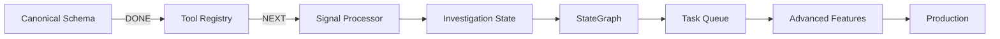

# LanggraphJS Integration - Project Roadmap

**Project:** Shaivra Intelligence Suite - LanggraphJS Integration
**Timeline:** 6 weeks (42 days)
**Started:** 2026-03-05
**Target Completion:** 2026-04-16

---

## Overview

Replace the basic agent network system with production-ready LangGraph StateGraph architecture, implementing canonical intelligence schemas, persistent state management, centralized tool registry, and async task processing.

---

## Phase Breakdown

### ✅ Phase 1: Foundation - Canonical Schema (COMPLETED)
**Duration:** 2 days
**Status:** ✅ COMPLETED 2026-03-05
**Task:** 2.1 - Canonical Intelligence Schema

**Deliverables:**
- [x] TypeScript types for EntityReference, Observation, Relationship, IntelligenceEvent
- [x] Prisma models for IntelligenceEvent and TaskQueue
- [x] Type guards for runtime validation
- [x] Comprehensive test suite (24 tests, 100% pass rate)
- [x] Bridge file with architectural decisions

**Files Created:**
- `src/types/intelligence.ts` (243 lines)
- `tests/unit/intelligence.test.ts` (737 lines)
- Prisma schema updates (53 lines)

**Commits:**
- `test: add tests for canonical intelligence schema`
- `feat: implement canonical intelligence schema`
- `feat: add IntelligenceEvent and TaskQueue database models`
- `docs: add LanggraphJS integration plan and task structure`

---

### 🔵 Phase 2: Tool Registry (CURRENT)
**Duration:** 3-4 days
**Status:** 🔵 READY TO START
**Task:** 3.1 - Tool Registry

**Objectives:**
1. Create ToolRegistry class with CRUD operations
2. Migrate 9 tools from langChainService.ts
3. Implement normalizers for all tools
4. Add rate limiting and reliability tracking
5. Achieve 80%+ test coverage

**Key Files:**
- `src/services/toolRegistry.ts` - Core registry
- `src/services/tools/*.ts` - Individual tools (9 files)
- `tests/unit/toolRegistry.test.ts` - Unit tests
- `tests/integration/toolRegistry.integration.test.ts` - Integration tests

**Success Criteria:**
- ✅ ToolRegistry class operational
- ✅ 9 tools migrated and registered
- ✅ All tools have normalizers
- ✅ 80%+ test coverage
- ✅ Zero regressions

**Plan:** `.plans/phase-2-tool-registry.md`

---

### ⏳ Phase 3: Signal Processing
**Duration:** 3-4 days
**Status:** ⏳ PENDING (After Phase 2)
**Task:** 4.2 - Signal Processor

**Objectives:**
1. Create SignalProcessor service
2. Implement tool-specific normalizers
3. Add Zod schema validation
4. Batch processing for multiple tools
5. Consolidation logic for duplicate entities

**Dependencies:**
- ✅ Canonical Schema (Phase 1)
- 🔵 Tool Registry (Phase 2)

**Key Features:**
- `normalizeShodanOutput()` - IP → EntityReference + Observations
- `normalizeTheHarvesterOutput()` - Emails/subdomains → entities
- `normalizeVirusTotalOutput()` - Threat indicators → IntelligenceEvent
- `validate()` - Schema validation against canonical types
- Batch normalization for multiple tool results

---

### ⏳ Phase 4: Investigation State & StateGraph
**Duration:** 5-7 days
**Status:** ⏳ PENDING
**Tasks:**
- 1.2 - Investigation State Model
- 1.3 - Investigation Graph (StateGraph)
- 1.3 - Investigation Orchestrator

**Objectives:**
1. Define InvestigationState interface
2. Implement immutable state update functions
3. Build LangGraph StateGraph with nodes
4. Create Investigation Orchestrator service
5. Replace runAgentNetwork() loop

**StateGraph Nodes:**
- **Initialize** - Set up investigation
- **Gather** - Invoke OSINT tools via registry
- **Analyze** - Calculate certainty from evidence
- **Synthesize** - Generate strategic report

**Routing Logic:**
- Loop if certainty < 80% and iterations < 5
- Exit to Synthesize when satisfied

---

### ⏳ Phase 5: Async Task Processing
**Duration:** 3-4 days
**Status:** ⏳ PENDING
**Tasks:**
- 1.4 - Task Queue
- 1.5 - Async Task Worker

**Objectives:**
1. Implement TaskQueue service (priority-based)
2. Create TaskWorker for background processing
3. Integrate with ToolRegistry
4. Add retry logic and error handling
5. Worker lifecycle management

**Key Features:**
- Priority queue (1-10 scale)
- Retry logic with exponential backoff
- Status tracking (pending → running → completed/failed)
- Worker polling (1 second interval)
- Task result storage in Prisma

---

### ⏳ Phase 6: Advanced Features
**Duration:** 7-10 days
**Status:** ⏳ PENDING
**Tasks:**
- 5.1 - Actor Fingerprint Engine
- 6.1 - Identity Investigation Graph
- 7.1 - LangSmith Observability
- 8.3 - Report Generation

**Objectives:**
1. Behavioral fingerprinting for actor attribution
2. Identity-focused investigation workflows
3. LangSmith tracing integration
4. Comprehensive report generation

**Features:**
- Temporal pattern detection
- Narrative similarity analysis
- Coordination scoring
- Entity resolution and deduplication
- Multi-format report output (JSON, Markdown)

---

### ⏳ Phase 7: Migration & Production
**Duration:** 3-5 days
**Status:** ⏳ PENDING

**Objectives:**
1. Add feature flag (USE_LANGGRAPH=true)
2. Parallel testing (old vs new system)
3. API endpoint migration
4. Remove deprecated code
5. Update frontend integration
6. Full E2E test suite
7. Production deployment

**Deliverables:**
- Feature flag implementation
- Comprehensive E2E tests
- Migration documentation
- Production deployment guide
- Performance benchmarks

---

## Overall Progress

**Completed:** 1/7 phases (14%)
**Current:** Phase 2 - Tool Registry
**Remaining:** 5 phases

### Timeline

```
Week 1: ✅ Phase 1 (Canonical Schema)
        🔵 Phase 2 (Tool Registry) - IN PROGRESS

Week 2: ⏳ Phase 3 (Signal Processor)

Week 3: ⏳ Phase 4 (Investigation State + StateGraph)

Week 4: ⏳ Phase 5 (Task Queue + Worker)

Week 5: ⏳ Phase 6 (Advanced Features)

Week 6: ⏳ Phase 7 (Migration & Production)
```

---

## Critical Path



**Current Position:** Between A and B

---

## Key Metrics

### Code Quality
- **Test Coverage:** 100% (Phase 1), Target: 80%+ overall
- **TypeScript Errors:** 0
- **ESLint Warnings:** 0
- **Tests Passing:** 24/24 (Phase 1)

### Progress Tracking
- **Tasks Completed:** 1/11 (9%)
- **Files Created:** 10+
- **Lines of Code:** ~1,500+
- **Tests Written:** 24 (107 assertions)

### Documentation
- [x] Project plan created
- [x] Task files for all epics
- [x] Bridge file for coordination
- [x] TDD workflow documented
- [ ] API documentation (pending Phase 2+)
- [ ] Integration guides (pending)

---

## Risk Management

### Active Risks
1. **Database Migration Pending**
   - Mitigation: Migration ready, waiting for DB availability
   - Impact: Low (doesn't block development)

2. **External API Availability**
   - Mitigation: Mock fallbacks for all tools
   - Impact: Medium (affects testing completeness)

3. **Scope Creep**
   - Mitigation: Strict task definitions, no feature additions
   - Impact: High (could delay timeline)

### Mitigations in Place
- Comprehensive test coverage prevents regressions
- Bridge file prevents architectural drift
- TDD workflow ensures quality
- Task files provide clear boundaries

---

## Next Steps

**Immediate Actions:**
1. ✅ Complete Phase 1 (Canonical Schema)
2. ✅ Commit and merge all Phase 1 work
3. ✅ Create Phase 2 implementation plan
4. 🔵 **START Phase 2: Tool Registry**
   - Begin with ToolRegistry core class
   - Follow TDD workflow strictly
   - Migrate DNS lookup tool first (simplest)

**This Week:**
- Complete Tool Registry implementation
- Migrate all 9 tools from langChainService.ts
- Achieve 80%+ test coverage
- Update bridge file with tool patterns

**Next Week:**
- Begin Signal Processor implementation
- Integrate with Tool Registry
- Start Investigation State modeling

---

## Documentation Index

| Document | Status | Location |
|----------|--------|----------|
| Main Integration Plan | ✅ Complete | `.plans/langgraph-integration.md` |
| Phase 2 Plan | ✅ Complete | `.plans/phase-2-tool-registry.md` |
| Project Roadmap | ✅ Complete | `.plans/ROADMAP.md` |
| Task README | ✅ Complete | `tasks/README.md` |
| Bridge File | ✅ Updated | `tasks/bridge.md` |
| Task 2.1 Spec | ✅ Complete | `tasks/2.1-canonical-schema.md` |
| Task 3.1 Spec | ✅ Complete | `tasks/3.1-tool-registry.md` |
| Task 4.2 Spec | ✅ Complete | `tasks/4.2-signal-processor.md` |

---

**Last Updated:** 2026-03-05
**Next Review:** After Phase 2 completion
**Status:** 🟢 ON TRACK
