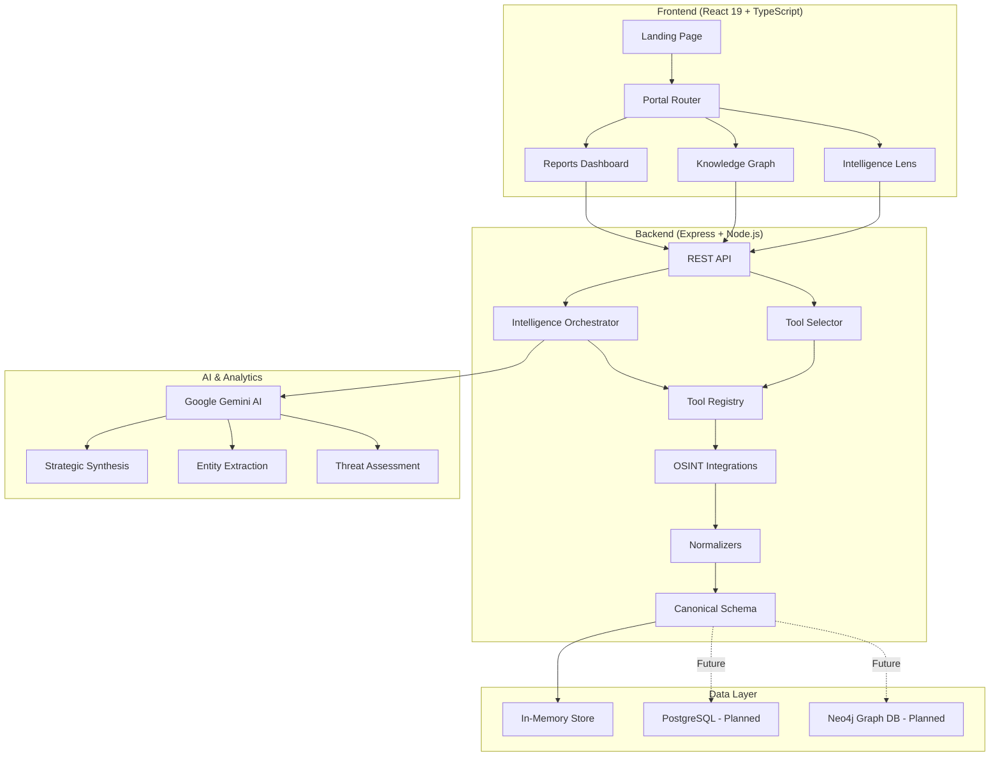
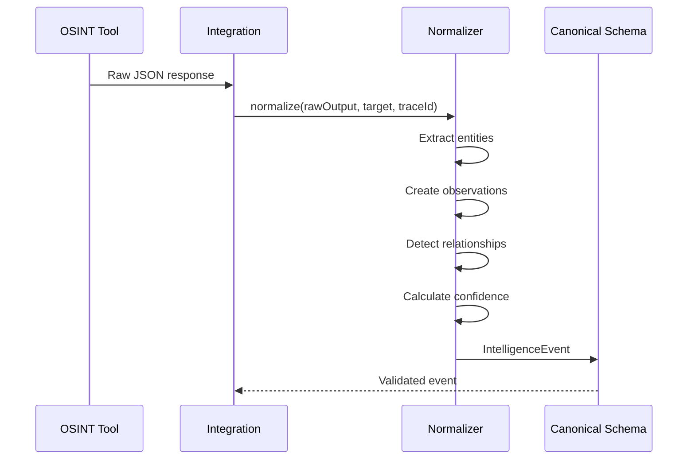
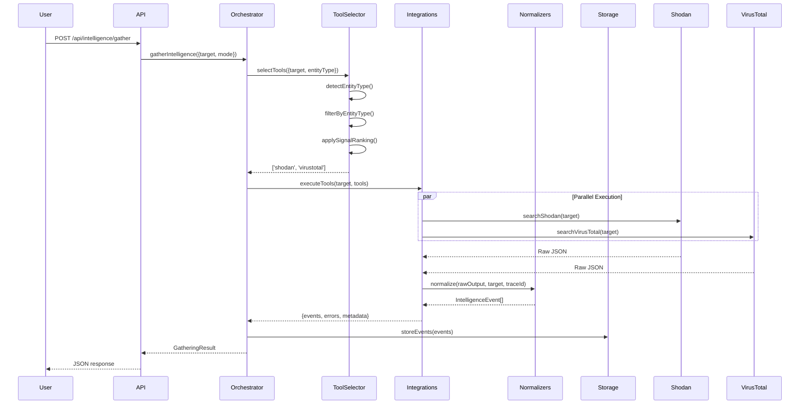
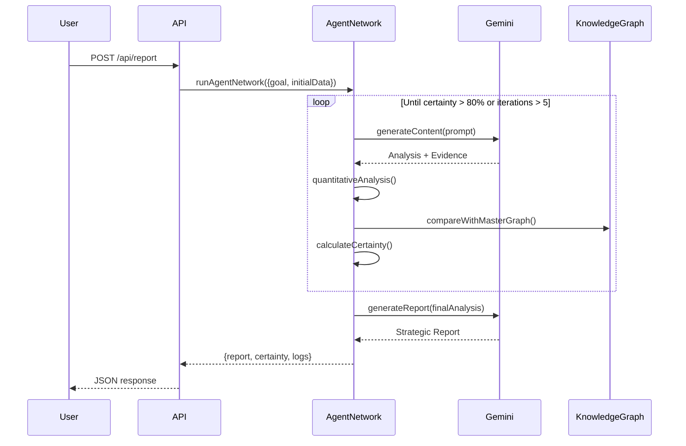
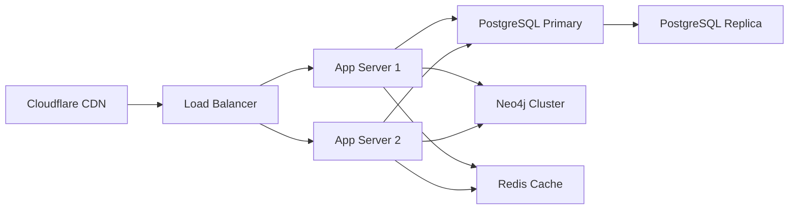

## Overview

Shaivra Intelligence Suite is built as a **monolithic full-stack application** with a React 19 frontend and Express + Node.js backend. The architecture prioritizes rapid development and intelligence gathering over distributed systems complexity.

**Key Characteristics:**
- Single codebase deployment
- Synchronous API with async background processing
- In-memory caching with optional Redis
- Google Gemini AI for strategic synthesis
- 20+ OSINT tool integrations

## High-Level Architecture



## Technology Stack

<CardGroup cols={3}>
  <Card title="Frontend" icon="react">
    - React 19
    - TypeScript 5.x
    - Vite 6.x
    - Tailwind CSS 4
    - Framer Motion
    - D3.js (graphs)
  </Card>

  <Card title="Backend" icon="node">
    - Node.js 20+
    - Express 4.x
    - TypeScript 5.x
    - Google Gemini AI
    - 20+ OSINT APIs
  </Card>

  <Card title="Infrastructure" icon="server">
    - Bun (package manager)
    - Vite dev server
    - In-memory storage
    - PostgreSQL (planned)
    - Neo4j (planned)
  </Card>
</CardGroup>

## Core Components

### 1. Intelligence Orchestrator

**Purpose:** High-level service that coordinates intelligence gathering across multiple OSINT tools.

**Location:** `src/server/services/intelligenceOrchestrator.ts`

**Responsibilities:**
- Select appropriate tools based on target type
- Execute tools in parallel with graceful degradation
- Aggregate results and calculate statistics
- Track errors and partial failures

**Example:**
```typescript
import { intelligenceOrchestrator } from './server/services/intelligenceOrchestrator';

const result = await intelligenceOrchestrator.gatherIntelligence({
  target: 'example.com',
  mode: 'fast',  // Top 2 tools only
  ranked: true   // Prioritize high-signal sources
});

// Result contains:
// - events: IntelligenceEvent[] (normalized data)
// - metadata: { executionTime, successfulTools, totalEntities }
// - errors: { tool, error }[] (failed tools)
```

### 2. Tool Selector

**Purpose:** Intelligent tool selection based on entity type, signal ranking, and cost optimization.

**Location:** `src/server/services/toolSelector.ts`

**Algorithm:**
```mermaid
graph TD
    A[Target Input] --> B{Detect Entity Type}
    B -->|IP Address| C[Infrastructure Tools]
    B -->|@username| D[Person Tools]
    B -->|Company Name| E[Organization Tools]
    C --> F[Filter by Entity Type]
    D --> F
    E --> F
    F --> G{Cost Aware?}
    G -->|Yes| H[Prefer Free Tools]
    G -->|No| I[All Tools]
    H --> J[Apply Signal Ranking]
    I --> J
    J --> K{Max Tools Limit?}
    K -->|Yes| L[Return Top N]
    K -->|No| M[Return All]
```

**Entity Detection Examples:**
- `93.184.216.34` → `infrastructure` (IP regex)
- `example.com` → `infrastructure` (domain pattern)
- `@johndoe` → `person` (@ prefix)
- `john@example.com` → `person` (email pattern)
- `Acme Corporation` → `organization` (capitalized multi-word)

### 3. Tool Registry

**Purpose:** Centralized metadata store for all OSINT tools.

**Location:** `src/server/services/toolSelector.ts` (TOOL_REGISTRY)

**Tool Metadata:**
```typescript
{
  name: 'shodan',
  layer: 2,              // Signal layer (1=highest, 5=lowest)
  entityTypes: ['infrastructure'],
  cost: 'paid',          // 'free' | 'free_tier' | 'paid'
  reliability: 0.95,     // Historical success rate
  avgExecutionTime: 2000 // Milliseconds
}
```

**Current Tools:**
| Tool | Layer | Entity Types | Cost | Status |
|------|-------|-------------|------|--------|
| Shodan | 2 | Infrastructure | Paid | ✅ Active |
| VirusTotal | 2 | Infrastructure | Free tier | ✅ Active |
| AlienVault OTX | 2 | Infrastructure | Free | ✅ Active |
| Twitter | 5 | Person, Org | Free tier | ✅ Active |
| Reddit | 5 | Person, Org | Free | ✅ Active |

### 4. OSINT Integrations

**Purpose:** API clients for external OSINT tools with caching and retry logic.

**Location:** `src/server/integrations/`

**Structure:**
```
src/server/integrations/
├── shodan.ts           ✅ Active
├── virustotal.ts       ✅ Active
├── alienvault.ts       ✅ Active
├── twitter.ts          ✅ Active
├── reddit.ts           ✅ Active
├── opencorporates.ts   🔨 Planned
├── secEdgar.ts         🔨 Planned
└── youtube.ts          🔨 Planned
```

**Integration Pattern:**
```typescript
export async function searchShodan(query: string): Promise<ShodanSearchResponse> {
  const apiKey = process.env.SHODAN_API_KEY;
  if (!apiKey) {
    return generateMockShodanData(query); // Graceful fallback
  }

  try {
    const response = await fetch(`https://api.shodan.io/shodan/host/search?key=${apiKey}&query=${query}`);
    if (!response.ok) throw new Error(`Shodan API error: ${response.statusText}`);
    return await response.json();
  } catch (error) {
    console.error('[Shodan] Search failed:', error);
    throw error;
  }
}
```

### 5. Normalizers

**Purpose:** Transform raw OSINT tool outputs to canonical IntelligenceEvent schema.

**Location:** `src/server/normalizers/`

**Structure:**
```
src/server/normalizers/
├── base.ts                     // BaseNormalizer interface
├── index.ts                    // Registry with auto-discovery
├── shodanNormalizer.ts        ✅ Active
├── virusTotalNormalizer.ts    ✅ Active
├── alienVaultNormalizer.ts    ✅ Active
├── twitterNormalizer.ts       ✅ Active
└── redditNormalizer.ts        ✅ Active
```

**Normalizer Flow:**


### 6. Google Gemini AI

**Purpose:** Strategic synthesis, entity extraction, threat assessment, and report generation.

**Model:** `gemini-2.0-flash-exp`

**Use Cases:**
```typescript
// 1. Web Search with Grounding
const searchResult = await gemini.generateContent({
  contents: [{ role: 'user', parts: [{ text: query }] }],
  tools: [{ googleSearch: {} }],
  toolConfig: { googleSearch: { dynamicRetrievalConfig: { mode: 'MODE_DYNAMIC' } } }
});

// 2. Structured Intelligence Synthesis
const synthesis = await gemini.generateContent({
  contents: [{ role: 'user', parts: [{ text: intelligencePrompt }] }],
  generationConfig: {
    responseMimeType: 'application/json',
    responseSchema: IntelligenceReportSchema
  }
});

// 3. Strategic Report Generation
const report = await gemini.generateContent({
  contents: [{ role: 'user', parts: [{ text: reportPrompt }] }],
  generationConfig: { temperature: 0.7, topP: 0.9 }
});
```

**Endpoints Using Gemini:**
- `POST /api/search` - Web search with grounding
- `POST /api/summarize` - Intelligence synthesis
- `POST /api/report` - Strategic reports
- `POST /api/analytics/summary` - Multi-domain analysis
- `POST /api/org/profile` - Organization profiling

### 7. Knowledge Graph (D3.js)

**Purpose:** Interactive visualization of entities and relationships.

**Location:** `src/components/KnowledgeGraphExplorer.tsx`

**Technology:** D3.js force-directed graph with custom force simulation.

**Data Flow:**
```mermaid
graph LR
    A[IntelligenceEvent[]] --> B[Extract Entities]
    A --> C[Extract Relationships]
    B --> D[Graph Nodes]
    C --> E[Graph Edges]
    D --> F[D3 Force Simulation]
    E --> F
    F --> G[SVG Rendering]
    G --> H[Interactive Canvas]
```

**Performance:**
- Handles <100 nodes efficiently
- Needs optimization for 1000+ nodes (Web Workers, virtualization)
- Consider switching to WebGL for 10K+ nodes

## Data Flow Architecture

### Intelligence Gathering Flow



### Report Generation Flow



## Storage Architecture

### Current (In-Memory)

**Status:** ⚠️ Development only - data lost on server restart

**Structure:**
```typescript
// server.ts (lines 60-68)
let masterGraph: any = { nodes: [], links: [], metadata: {} };
let dailyReports: any[] = [];
let weeklyReports: any[] = [];
let projects: any[] = [];
let campaignResults: any[] = [];
let investigations: any[] = [];
let orgProfiles: any[] = [];
```

**Limitations:**
- No persistence across restarts
- No data recovery
- No horizontal scaling
- No transaction support
- Memory leaks with large datasets

### Planned (PostgreSQL + Neo4j)

**PostgreSQL:** Relational data (events, users, investigations)

```sql
-- Intelligence events and observations
CREATE TABLE intelligence_events (...);
CREATE TABLE entities (...);
CREATE TABLE observations (...);

-- User management
CREATE TABLE users (...);
CREATE TABLE investigations (...);
CREATE TABLE reports (...);
```

**Neo4j:** Knowledge graph (entities and relationships)

```cypher
// Create entity nodes
CREATE (e:Entity {id, type, name, confidence, attributes})

// Create relationships
MATCH (source:Entity), (target:Entity)
CREATE (source)-[r:RELATIONSHIP {type, strength, evidence}]->(target)

// Query paths
MATCH path = (start:Entity)-[*1..3]-(end:Entity)
WHERE start.name = 'example.com'
RETURN path
```

## Security Architecture

### Current (Development)

**⚠️ CRITICAL GAPS:**
- Hardcoded credentials (`shaivra-ai` / `ShaivraAdmin345%`)
- No input validation (raw req.body accepted)
- No rate limiting (vulnerable to DDoS)
- No CSRF protection
- API keys exposed client-side (Vite define)

### Required (Production)

**Authentication:**
```typescript
import { createClient } from '@supabase/supabase-js';

const supabase = createClient(
  process.env.SUPABASE_URL!,
  process.env.SUPABASE_ANON_KEY!
);

// Verify JWT on all protected endpoints
app.use('/api/portal/*', async (req, res, next) => {
  const token = req.headers.authorization?.split(' ')[1];
  const { data: { user }, error } = await supabase.auth.getUser(token);
  if (error || !user) return res.status(401).json({ error: 'Unauthorized' });
  req.user = user;
  next();
});
```

**Input Validation:**
```typescript
import { z } from 'zod';

const GatheringRequestSchema = z.object({
  target: z.string().min(1).max(500),
  entityType: z.enum(['person', 'organization', 'infrastructure', 'event']).optional(),
  mode: z.enum(['fast', 'comprehensive', 'custom']).default('comprehensive')
});

app.post('/api/intelligence/gather', async (req, res) => {
  const validated = GatheringRequestSchema.parse(req.body);
  // ...
});
```

**Rate Limiting:**
```typescript
import rateLimit from 'express-rate-limit';

const limiter = rateLimit({
  windowMs: 15 * 60 * 1000, // 15 minutes
  max: 100 // Max 100 requests per window
});

app.use('/api/', limiter);
```

## Deployment Architecture

### Development

```bash
# Single process, hot reload
bun run dev  # Runs: tsx server.ts
# → Express on :3000 with Vite middleware
# → Frontend served from /
# → API on /api/*
```

### Production (Planned)



**Components:**
- **CDN:** Cloudflare (static assets, DDoS protection)
- **Load Balancer:** AWS ALB or Railway
- **App Servers:** Docker containers (Express + React build)
- **Database:** PostgreSQL (Supabase/Neon) + Neo4j Aura
- **Cache:** Upstash Redis
- **Storage:** AWS S3 (reports, uploads)
- **Monitoring:** Sentry + DataDog

## Performance Considerations

<AccordionGroup>
  <Accordion title="Parallel Tool Execution">
    Tools execute in parallel using `Promise.all`:
    ```typescript
    const results = await Promise.all(
      tools.map(tool => executeToolWithTimeout(tool, target, 30000))
    );
    ```

    **Benefits:**
    - 50% faster than sequential (Fast Mode)
    - Graceful degradation (continue if some fail)
    - Total time = slowest tool, not sum of all tools
  </Accordion>

  <Accordion title="Caching Strategy">
    OSINT results cached by target + tool + timestamp:
    ```typescript
    const cacheKey = `osint:${tool}:${target}:${dateKey}`;
    const cached = cache.get(cacheKey);
    if (cached) return cached;

    const fresh = await fetchFromAPI();
    cache.set(cacheKey, fresh, 3600); // 1 hour TTL
    return fresh;
    ```

    **Cache Invalidation:**
    - Time-based: 1 hour for infrastructure, 15 minutes for social media
    - Manual: User can force refresh
  </Accordion>

  <Accordion title="Token Management">
    Gemini AI has token limits (2M input, 8K output):
    ```typescript
    // Truncate large datasets before sending to Gemini
    const truncatedData = JSON.stringify(intelligenceData).substring(0, 2000);
    const prompt = `Analyze: ${truncatedData}`;
    ```

    **Future:** Implement signal ranking to prioritize high-quality data and stay within limits.
  </Accordion>

  <Accordion title="Graph Rendering Optimization">
    D3.js force simulation for <100 nodes:
    ```typescript
    const simulation = d3.forceSimulation(nodes)
      .force('link', d3.forceLink(links))
      .force('charge', d3.forceManyBody().strength(-300))
      .force('center', d3.forceCenter(width / 2, height / 2));
    ```

    **For 1000+ nodes:**
    - Use Web Workers for physics simulation
    - Implement level-of-detail rendering
    - Add virtualization (only render visible nodes)
    - Consider WebGL (sigma.js, ForceGraph3D)
  </Accordion>
</AccordionGroup>

## Observability

### Current

- Console logging (`console.log`, `console.error`)
- No structured logging
- No distributed tracing
- No performance metrics

### Planned

**Structured Logging:**
```typescript
import winston from 'winston';

const logger = winston.createLogger({
  level: 'info',
  format: winston.format.json(),
  transports: [
    new winston.transports.File({ filename: 'error.log', level: 'error' }),
    new winston.transports.File({ filename: 'combined.log' })
  ]
});

logger.info('Intelligence gathered', {
  target: 'example.com',
  toolsUsed: ['shodan', 'virustotal'],
  executionTime: 2500,
  traceId: 'trace-001'
});
```

**Distributed Tracing (LangSmith):**
```typescript
import { LangChainTracer } from 'langchain/callbacks';

const tracer = new LangChainTracer({
  projectName: 'shaivra-intelligence',
  apiKey: process.env.LANGSMITH_API_KEY
});

// Trace all tool invocations
await intelligenceOrchestrator.gatherIntelligence({
  target: 'example.com',
  callbacks: [tracer]
});
```

## Next Steps

<CardGroup cols={2}>
  <Card title="Quickstart" icon="rocket" href="/quickstart">
    Get up and running in 5 minutes
  </Card>

  <Card title="API Reference" icon="code" href="/api/intelligence-gathering">
    Complete REST API documentation
  </Card>

  <Card title="Deployment" icon="cloud" href="/operations/deployment">
    Deploy to production
  </Card>

  <Card title="Security" icon="shield" href="/platform/security">
    Harden for production use
  </Card>
</CardGroup>
