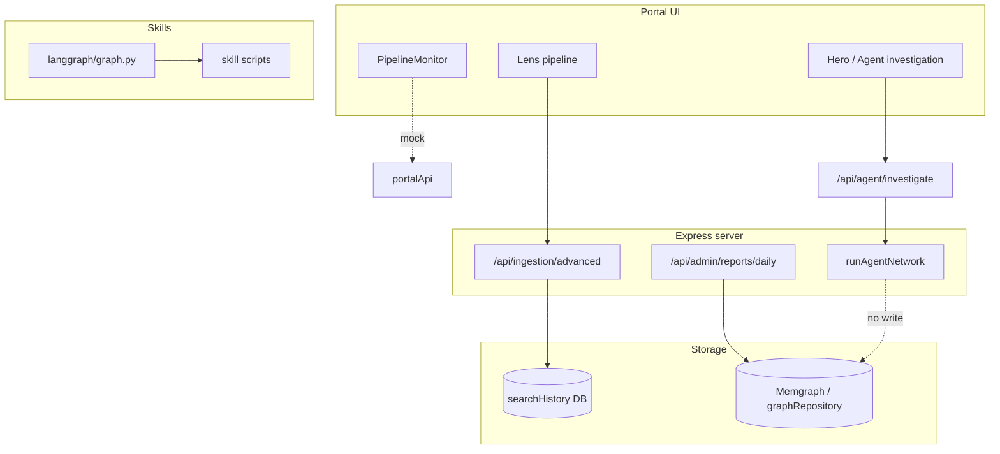

# Ingestion and Separation of Concerns

This document describes the separation of concerns between project/user investigation ingestion, knowledge-base (Memgraph) ingestion, the agent network, and skills. It defines the single ingest→normalize→enrich pipeline and integration points. More features (queue, workers, promote-to-KB API) will be added later.

## Four concerns

| Concern | Purpose | Data flow | Ownership |
|--------|---------|-----------|-----------|
| **1. Project / user investigation ingestion** | User- or project-triggered runs from Lens/PipelineMonitor: one target, selected sources, project-scoped results and audit. | Frontend → backend ingestion API → ingest → normalize → enrich (single pipeline) → project/job storage + optional graph write. | Backend owns pipeline; frontend triggers and displays. |
| **2. Knowledge-base (Memgraph) ingestion** | Persistent graph and KB: batch or scheduled ingestion, curated feeds, or results promoted from investigations. | Same ingest → normalize → enrich pipeline; output written to Memgraph (and optionally project/job) with a "knowledge_base" or "promoted" intent. | Backend; distinct API or intent flag so KB writes are explicit. |
| **3. Agent network** | Reasoning and refinement over existing data: report generation, search refinement, org profiling, investigation completion. | Consumes normalized/enriched data (and optionally reads from Memgraph); does not perform raw ingestion. Can invoke skills via a defined contract. | Backend; no duplication of ingest/normalize/enrich inside the agent loop. |
| **4. Skills** | Reusable OSINT/influence/defense scripts and langgraph DAG; used by AI orchestrators or by the backend when "running a skill" is needed. | Input: target, sources, optional context. Output: entity_graph, narrative_simulation, threat_surface, etc. Skills do not write directly to Memgraph or project DB; the caller decides whether to persist. | skills/ and langgraph/; integration points documented; when used from server, called via driver/script or small adapter. |

## Current architecture (high level)

## Full implemented pipeline steps

Two UIs define the pipeline; new work should **respect and enhance** these steps, not remove or reorder them.

**Lens pipeline** (`src/pages/portal/Lens.tsx`):  
0. OSINT Recon (Maltego) → 1. Ingestion → 2. Normalization → 3. Enrichment → 4. Clustering → 5. LLM Analysis → 6. (optional) Fingerprint → 7. Audit.

**PipelineMonitor / DeepAgent** (`src/components/PipelineMonitor.tsx`):  
Fetch (public source) → Ingest → Normalize → Enrich → Extract (entities) → Correlate (strategic correlation) → OSINT (tool enrichment) → Graph update → Report.

**Unified sequence** (support both and future features):  
Fetch/Source → **Ingest** → **Normalize** → **Standardise & Deduplicate** → **Enrich** → Extract (entities) → Clustering (optional) → Correlate (optional) → OSINT tool enrichment (optional) → LLM analysis (optional) → Graph update → Report → Fingerprint (optional) → Audit (optional).

Core data-quality chain for ingested data from public APIs: **Ingest → Normalize → Standardise & Deduplicate → Enrich**. The Standardise & Deduplicate step assigns one canonical unique ID per entity, normalises names (handles, display names), and merges duplicates using content-aware and fuzzy matching. Implemented in `src/server/services/standardiseAndDeduplicate.ts` and invoked by the intelligence orchestrator. Downstream steps consume the normalized/deduplicated output. Mocks can be replaced incrementally with real backend implementations.

## Schemas and contracts (smooth processing from public APIs)

Existing contracts ensure ingested data from public OSINT APIs flows into a single canonical form.

**Canonical output (all tool data ends here):**  
- `src/contracts/intelligence.ts`: `EntityReference`, `Observation`, `Relationship`, `IntelligenceEvent`; runtime validators `isIntelligenceEvent`, `isEntityReference`. All OSINT tool output must be normalized to `IntelligenceEvent` before entering the knowledge graph or downstream steps. Bridge rules (confidence 0–1, UUIDs, source attribution) apply.

**Pipeline step contracts (handoff between stages):**  
- `src/contracts/portal.ts`: `IngestionEvent` (raw_id, source_type, payload, checksum, trace_id); `NormalizedEvent` (event_id, canonical_type, normalized_text, source_ref); `LensNormalizationResult`, `LensEnrichmentResult`, `LensClusteringResult`, `LensLLMReport`, `LensAuditEntry`; plus types for extracted entities, strategic correlation, graph update, report. These define the shape at each step so Lens and PipelineMonitor can pass data smoothly when mocks are replaced by real endpoints.

**Public API → canonical (normalizers):**  
- `src/server/normalizers/base.ts`: `BaseNormalizer<TRawOutput>.normalize(rawOutput, target, traceId, investigationId?)` returns `IntelligenceEvent`.  
- `src/server/normalizers/index.ts`: `NormalizerRegistry` with Shodan, VirusTotal, AlienVault. Each public API returns raw payloads; the registry lookup + normalizer produces `IntelligenceEvent`.  
- `src/server/services/osintAggregator.ts`: Returns `OSINTResult { event?: IntelligenceEvent }` per tool; aggregator uses the registry and attaches the normalized event. **Shodan, VirusTotal, and AlienVault already flow through normalizers to canonical form.**

**Request validation (API boundary):**  
- `src/server/validation/schemas.ts`: Zod schemas for search, report, org profile, investigation (and others). Validate incoming requests so ingestion and agent endpoints receive well-shaped inputs.

**Gap (future work):** `POST /api/ingestion/advanced` uses a Gemini ad-hoc schema and does not run through normalizers or produce `IntelligenceEvent`; it writes to searchHistory only. Future "advanced ingestion" or Gemini-backed ingestion should either (a) produce output in a form that an existing or new normalizer can convert to `IntelligenceEvent`, or (b) go through a generic ingest step that wraps and then normalizes so all ingested data flows through the same canonical pipeline.

## Core pipeline and where existing pieces fit

**Core chain:** Ingest → Normalize → Standardise & Deduplicate → Enrich.

- **Ingest:** Accept raw payload (e.g. from OSINT tools, Gemini fetch, or skill output); produce a raw event conforming to `IngestionEvent`. For "advanced ingestion" and skills, add a normalizer for Gemini/skill output or a generic ingest step that wraps JSON for normalizers.
- **Normalize:** Run through `NormalizerRegistry` (or a generic normalizer for non-tool payloads) and produce `IntelligenceEvent`. Pipeline step contract: `LensNormalizationResult` / `NormalizedEvent`.
- **Standardise & Deduplicate:** Take `IntelligenceEvent[]` from multiple tools; assign one canonical unique ID per entity; normalise names (handles, display names, domains, IPs); merge entities that refer to the same real-world thing (content-aware and fuzzy name matching); deduplicate observations and relationships. Output: consolidated `IntelligenceEvent[]` (single merged event in practice). Part of intelligence gathering (orchestrator).
- **Enrich:** Take `IntelligenceEvent`; add entity resolution, risk scoring, or link suggestions. Output remains canonical. Pipeline step contract: `LensEnrichmentResult` and related types.

**Downstream steps** (already in UIs; enhance with real backend when adding features): Extract → Clustering → Correlate → OSINT tool enrichment → LLM analysis → Graph update → Report → Fingerprint → Audit. Each has or should have a corresponding contract in `src/contracts/portal.ts`.

**Existing pieces:**  
- Advanced ingestion (`/api/ingestion/advanced`): currently ad-hoc; will plug into the pipeline when a normalizer or generic ingest path is added.  
- Normalizers and `osintAggregator`: already feed public API data into `IntelligenceEvent`.  
- `graphRepository`: single writer for Memgraph; future adapter from `IntelligenceEvent` → Entity/RELATED for KB writes.

## Integration points

1. **Frontend → backend:** Lens/PipelineMonitor will eventually call real ingest/normalize/enrich endpoints (or a single "run pipeline" endpoint) instead of mocks; `projectId` and `investigationId` tie results to a project/user run.
2. **Backend → Memgraph:** "Knowledge base ingestion" is any flow that writes to Memgraph (e.g. daily report, or a dedicated "promote to KB" / "KB ingest" endpoint). Use a single writer (`graphRepository`) and a clear mapping from `IntelligenceEvent` → graph.
3. **Agent network → pipeline:** `runAgentNetwork` should receive already normalized/enriched data when available (e.g. from a prior pipeline run or from Memgraph); it should not perform ingestion itself. Optionally: server calls `scripts/run_pipeline.sh` or `langgraph/graph.py` with target/sources and uses the output as input to the agent (or writes it via the same pipeline).
4. **Skills → backend:** When the server needs to "run a skill", it invokes the unified driver (`scripts/run_pipeline.sh` or `langgraph/graph.py`); the server then takes the JSON output and, if persistence is required, feeds it into the ingest → normalize → enrich pipeline (skills remain the execution layer, backend owns persistence and schema).

## Later features

- Real ingest/normalize/enrich HTTP endpoints or replacing mocks.  
- Queue/workers for ingestion.  
- "Promote to KB" or dedicated KB ingest API.  
- Agent network calling skills or reading from Memgraph.
