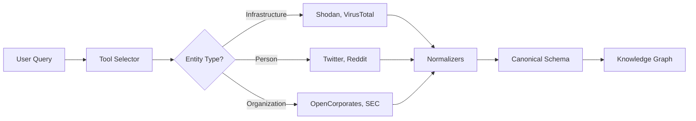

## What is Shaivra?

Shaivra Intelligence Suite is a production-grade OSINT (Open-Source Intelligence) platform that automatically gathers, normalizes, and analyzes intelligence from 20+ data sources.

**Key Capabilities:**
- **Smart Tool Selection** - Automatically chooses relevant OSINT tools based on target type
- **Canonical Schema** - All data normalized to unified IntelligenceEvent format
- **Signal Ranking** - Prioritizes authoritative sources (Layer 1) over narratives (Layer 5)
- **Cost Optimization** - Reduces API costs by 33% through intelligent tool selection

<CardGroup cols={2}>
  <Card title="Quickstart" icon="rocket" href="/quickstart">
    Get up and running in 5 minutes
  </Card>
  <Card title="Architecture" icon="sitemap" href="/architecture">
    Understand the system design
  </Card>
  <Card title="API Reference" icon="code" href="/api/overview">
    Complete REST API documentation
  </Card>
  <Card title="OSINT Tools" icon="magnifying-glass" href="/osint/overview">
    Learn about OSINT tool integration
  </Card>
</CardGroup>

## Core Features

<AccordionGroup>
  <Accordion title="Intelligent Tool Selection" icon="filter">
    Automatically selects the right OSINT tools based on target entity type (IP, domain, person, organization). Supports signal ranking, cost optimization, and custom filters.

    **Example**: Query `@username` → Automatically selects Twitter & Reddit (not Shodan).

    [Learn more →](/osint/tool-selection)
  </Accordion>

  <Accordion title="Canonical Intelligence Schema" icon="database">
    All OSINT tool outputs normalize to a unified `IntelligenceEvent` schema with entities, observations, and relationships. Enables cross-tool correlation and confidence scoring.

    **Benefits**: Mix data from 20+ sources without custom parsers.

    [Learn more →](/osint/canonical-schema)
  </Accordion>

  <Accordion title="Signal Quality Ranking" icon="signal">
    Tools organized into 5 layers by signal quality:
    - **Layer 1**: Authoritative records (OpenCorporates, SEC EDGAR) - confidence 1.0
    - **Layer 2**: Infrastructure intel (Shodan, VirusTotal) - confidence 0.95
    - **Layer 3**: Correlation tools (Maltego, SpiderFoot) - confidence 0.85
    - **Layer 4**: Enrichment sources (SecurityTrails) - confidence 0.80
    - **Layer 5**: Narrative sources (Twitter, Reddit) - confidence 0.75

    Higher layers always prioritized when selecting tools.

    [Learn more →](/osint/tool-selection#signal-ranking-system)
  </Accordion>

  <Accordion title="Production-Ready Security" icon="shield">
    - Supabase authentication with Row-Level Security
    - Rate limiting (per-endpoint and per-user)
    - CSRF protection for state-changing operations
    - Input validation with Zod schemas
    - API key management in secure environment variables

    [Learn more →](/platform/security)
  </Accordion>
</AccordionGroup>

## Quick Example

```typescript
import { intelligenceOrchestrator } from './server/services/intelligenceOrchestrator';

// Gather intelligence from automatically selected tools
const result = await intelligenceOrchestrator.gatherIntelligence({
  target: 'example.com',
  mode: 'fast',  // Top 2 tools only
  ranked: true   // Prioritize high-signal sources
});

console.log(result);
// {
//   toolsUsed: ['shodan', 'virustotal'],
//   events: [/* Normalized intelligence events */],
//   metadata: {
//     totalEntities: 2,
//     totalObservations: 8,
//     executionTime: 2500
//   }
// }
```

## Architecture at a Glance



## Technology Stack

<CardGroup cols={3}>
  <Card title="React 19" icon="react">
    Modern frontend with TypeScript + Vite
  </Card>
  <Card title="Express + Node" icon="node">
    RESTful API with middleware pipeline
  </Card>
  <Card title="Supabase" icon="database">
    PostgreSQL with RLS + Auth
  </Card>
  <Card title="Memgraph" icon="project-diagram">
    Graph database for knowledge graph
  </Card>
  <Card title="LangGraph" icon="brain">
    Agent orchestration framework
  </Card>
  <Card title="Google Gemini" icon="sparkles">
    AI-powered synthesis and analysis
  </Card>
</CardGroup>

## Next Steps

<Steps>
  <Step title="Install Dependencies">
    ```bash
    bun install
    ```
  </Step>

  <Step title="Configure Environment">
    Copy `.env.example` to `.env` and add API keys:
    ```bash
    cp .env.example .env
    ```
  </Step>

  <Step title="Start Development Server">
    ```bash
    bun run dev
    ```
  </Step>

  <Step title="Explore the API">
    Read the [API documentation](/api/intelligence-gathering) and make your first request
  </Step>
</Steps>

:::tip Need Help?
Join our [GitHub Discussions](https://github.com/metacogna/shaivra-intelligence-suite/discussions) or check the [troubleshooting guide](/operations/troubleshooting).
:::
