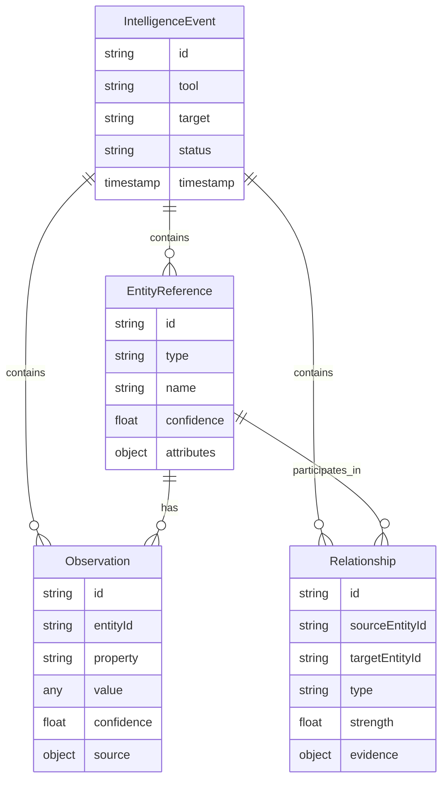

## What is the Canonical Schema?

The **Canonical Intelligence Schema** is a unified data model that represents all OSINT intelligence as structured entities, observations, and relationships. Instead of 20+ tool-specific formats, every piece of intelligence conforms to this single schema, enabling:

- **Cross-tool correlation** - Compare findings across Shodan, VirusTotal, Twitter
- **Knowledge graph construction** - Build Neo4j/Memgraph databases directly
- **Confidence aggregation** - Combine evidence from multiple sources
- **Strategic synthesis** - Generate reports from unified data

## Core Data Types



## IntelligenceEvent

Top-level container for all intelligence gathered from a single OSINT tool execution.

### TypeScript Definition

```typescript
export interface IntelligenceEvent {
  // Unique event identifier (UUID v4)
  id: string;

  // Tool that generated this event
  tool: string;

  // Investigation target (IP, domain, username, organization)
  target: string;

  // Execution status
  status: 'success' | 'error' | 'partial';

  // ISO 8601 timestamp
  timestamp: string;

  // Discovered entities
  entities: EntityReference[];

  // Facts about entities
  observations: Observation[];

  // Connections between entities
  relationships: Relationship[];

  // Optional: Error details if status='error'
  error?: {
    code: string;
    message: string;
    details?: any;
  };

  // Optional: Link to investigation
  investigationId?: string;

  // Optional: Trace ID for observability
  traceId?: string;

  // Optional: Execution metadata
  metadata?: {
    executionTime?: number;
    apiCallCount?: number;
    cacheHit?: boolean;
    [key: string]: any;
  };
}
```

### Example

```json
{
  "id": "550e8400-e29b-41d4-a716-446655440000",
  "tool": "shodan",
  "target": "example.com",
  "status": "success",
  "timestamp": "2024-03-05T10:00:00Z",
  "entities": [
    {
      "id": "ent-001",
      "type": "infrastructure",
      "name": "93.184.216.34",
      "confidence": 0.95,
      "attributes": {
        "org": "Example Organization",
        "country": "United States"
      }
    }
  ],
  "observations": [
    {
      "id": "obs-001",
      "entityId": "ent-001",
      "property": "open_port",
      "value": { "port": 443, "service": "HTTPS" },
      "confidence": 0.95,
      "source": {
        "tool": "shodan",
        "timestamp": "2024-03-05T10:00:00Z"
      }
    }
  ],
  "relationships": [],
  "traceId": "trace-001",
  "metadata": {
    "executionTime": 1500,
    "apiCallCount": 1,
    "cacheHit": false
  }
}
```

### Field Descriptions

<ParamField path="id" type="string" required>
  Unique event identifier. Generated using UUID v4 format.
</ParamField>

<ParamField path="tool" type="string" required>
  Name of OSINT tool that produced this event. Must match registered tool name in ToolRegistry.

  Valid values: `shodan`, `virustotal`, `alienvault`, `twitter`, `reddit`, etc.
</ParamField>

<ParamField path="target" type="string" required>
  Investigation target. Can be:
  - IP address: `93.184.216.34`
  - Domain: `example.com`
  - Username: `@johndoe` or `johndoe`
  - Email: `user@example.com`
  - Organization: `Acme Corporation`
</ParamField>

<ParamField path="status" type="string" required>
  Execution status:
  - `success` - Tool executed without errors, data returned
  - `error` - Tool failed completely, no data returned
  - `partial` - Tool executed but some operations failed
</ParamField>

<ParamField path="timestamp" type="string" required>
  ISO 8601 timestamp when event was created. Example: `2024-03-05T10:00:00Z`
</ParamField>

<ParamField path="entities" type="EntityReference[]" required>
  Array of discovered entities. Can be empty if no entities found.
</ParamField>

<ParamField path="observations" type="Observation[]" required>
  Array of facts about entities. Can be empty if no observations made.
</ParamField>

<ParamField path="relationships" type="Relationship[]" required>
  Array of connections between entities. Can be empty if no relationships detected.
</ParamField>

<ParamField path="error" type="object">
  Error details when `status='error'` or `status='partial'`.

  ```typescript
  {
    code: 'API_RATE_LIMIT',
    message: 'Rate limit exceeded. Retry after 60s.',
    details: { retryAfter: 60 }
  }
  ```
</ParamField>

<ParamField path="investigationId" type="string">
  UUID of parent investigation. Links event to broader investigation context.
</ParamField>

<ParamField path="traceId" type="string">
  Distributed tracing identifier. Used for observability and debugging.
</ParamField>

<ParamField path="metadata" type="object">
  Execution statistics and tool-specific metadata.

  Common fields:
  - `executionTime` (number) - Milliseconds to complete
  - `apiCallCount` (number) - API requests made
  - `cacheHit` (boolean) - Whether result was cached
</ParamField>

## EntityReference

Represents a discovered entity (person, organization, infrastructure, event).

### TypeScript Definition

```typescript
export interface EntityReference {
  // Unique entity identifier
  id: string;

  // Entity type
  type: 'person' | 'organization' | 'infrastructure' | 'event' | 'unknown';

  // Primary name/identifier
  name: string;

  // Alternate names (usernames, aliases, IPs)
  aliases?: string[];

  // Confidence score (0.0 - 1.0)
  confidence: number;

  // Arbitrary attributes
  attributes?: Record<string, any>;

  // Source tool metadata
  sourceMetadata?: {
    tool: string;
    timestamp: string;
    [key: string]: any;
  };
}
```

### Entity Types

<AccordionGroup>
  <Accordion title="person" icon="user">
    **Represents:** Individuals with online presence

    **Examples:**
    - Twitter user: `@johndoe`
    - Reddit account: `johndoe123`
    - Email: `john.doe@example.com`
    - GitHub contributor: `johndoe`

    **Common attributes:**
    ```typescript
    {
      verified: boolean,
      account_age_days: number,
      followers_count: number,
      platform: 'twitter' | 'reddit' | 'linkedin'
    }
    ```
  </Accordion>

  <Accordion title="organization" icon="building">
    **Represents:** Companies, non-profits, government agencies

    **Examples:**
    - Public company: `Example Corporation (NASDAQ: EXMP)`
    - Private company: `Acme Inc.`
    - Government: `Department of Defense`

    **Common attributes:**
    ```typescript
    {
      jurisdiction: string,
      incorporation_date: string,
      industry: string,
      employees: number,
      public: boolean,
      ticker?: string
    }
    ```
  </Accordion>

  <Accordion title="infrastructure" icon="server">
    **Represents:** Digital infrastructure and technical assets

    **Examples:**
    - IP address: `93.184.216.34`
    - Domain: `example.com`
    - Subdomain: `api.example.com`
    - ASN: `AS15169` (Google)

    **Common attributes:**
    ```typescript
    {
      org: string,
      country: string,
      city: string,
      asn: string,
      hosting_provider: string
    }
    ```
  </Accordion>

  <Accordion title="event" icon="calendar">
    **Represents:** Time-bound occurrences

    **Examples:**
    - Security incident: `Log4Shell Exploitation Campaign`
    - Threat pulse: `AlienVault Pulse #12345`
    - Campaign: `APT29 Phishing Campaign`

    **Common attributes:**
    ```typescript
    {
      start_date: string,
      end_date?: string,
      severity: 'low' | 'medium' | 'high' | 'critical',
      status: 'active' | 'resolved' | 'monitoring'
    }
    ```
  </Accordion>

  <Accordion title="unknown" icon="question">
    **Represents:** Entities that don't fit other categories

    **Use case:** Temporary classification until more context available

    **Common attributes:**
    ```typescript
    {
      raw_identifier: string,
      detection_confidence: number
    }
    ```
  </Accordion>
</AccordionGroup>

### Example

```json
{
  "id": "ent-001",
  "type": "infrastructure",
  "name": "93.184.216.34",
  "aliases": ["example.com", "www.example.com"],
  "confidence": 0.95,
  "attributes": {
    "org": "Example Organization",
    "country": "United States",
    "city": "Los Angeles",
    "asn": "AS15133",
    "hosting_provider": "Edgecast"
  },
  "sourceMetadata": {
    "tool": "shodan",
    "timestamp": "2024-03-05T10:00:00Z",
    "scan_id": "abc123"
  }
}
```

## Observation

Facts about entities with confidence scores and source attribution.

### TypeScript Definition

```typescript
export interface Observation {
  // Unique observation identifier
  id: string;

  // Entity this observation is about
  entityId: string;

  // Property name (standardized vocabulary)
  property: string;

  // Property value (arbitrary structure)
  value: any;

  // Confidence score (0.0 - 1.0)
  confidence: number;

  // Source attribution
  source: {
    tool: string;
    traceId?: string;
    timestamp: string;
    [key: string]: any;
  };

  // ISO 8601 timestamp when observation was made
  timestamp?: string;

  // Optional: Links to supporting evidence
  evidence?: Array<{
    type: 'url' | 'screenshot' | 'document';
    uri: string;
    description?: string;
  }>;
}
```

### Standard Property Names

<Tabs>
  <Tab title="Infrastructure">
    **Properties for `type='infrastructure'` entities:**

    | Property | Value Type | Example |
    |----------|-----------|---------|
    | `open_port` | `{ port: number, service: string }` | `{ port: 443, service: "HTTPS" }` |
    | `vulnerability` | `{ cve: string, severity: string }` | `{ cve: "CVE-2021-44228", severity: "critical" }` |
    | `ssl_certificate` | `{ issuer: string, expiry: string }` | `{ issuer: "Let's Encrypt", expiry: "2025-01-01" }` |
    | `dns_record` | `{ type: string, value: string }` | `{ type: "A", value: "1.2.3.4" }` |
    | `technology` | `{ name: string, version?: string }` | `{ name: "nginx", version: "1.18.0" }` |
    | `threat_score` | `{ score: number, max: number }` | `{ score: 75, max: 100 }` |
    | `reputation` | `{ score: number, category: string }` | `{ score: -5, category: "malicious" }` |
  </Tab>

  <Tab title="Person">
    **Properties for `type='person'` entities:**

    | Property | Value Type | Example |
    |----------|-----------|---------|
    | `social_influence` | `{ platform: string, followers: number, tier: string }` | `{ platform: "twitter", followers: 15000, tier: "micro" }` |
    | `engagement_pattern` | `{ posts_per_day: number, engagement_rate: number }` | `{ posts_per_day: 2.4, engagement_rate: 0.05 }` |
    | `verified_status` | `{ platform: string, verified: boolean }` | `{ platform: "twitter", verified: true }` |
    | `account_age` | `{ platform: string, created_at: string, days: number }` | `{ platform: "reddit", created_at: "2020-01-01", days: 1500 }` |
    | `post_sentiment` | `{ sentiment: string, score: number }` | `{ sentiment: "positive", score: 0.85 }` |
    | `topic_affinity` | `{ topic: string, frequency: number }` | `{ topic: "cybersecurity", frequency: 0.45 }` |
  </Tab>

  <Tab title="Organization">
    **Properties for `type='organization'` entities:**

    | Property | Value Type | Example |
    |----------|-----------|---------|
    | `financial_metric` | `{ metric: string, value: number, unit: string }` | `{ metric: "revenue", value: 1500000, unit: "USD" }` |
    | `regulatory_filing` | `{ type: string, date: string, url: string }` | `{ type: "10-K", date: "2024-02-01", url: "..." }` |
    | `executive` | `{ name: string, title: string }` | `{ name: "Jane Doe", title: "CEO" }` |
    | `industry_classification` | `{ code: string, description: string }` | `{ code: "NAICS-541511", description: "Software Development" }` |
    | `contract_award` | `{ agency: string, amount: number, date: string }` | `{ agency: "DoD", amount: 500000, date: "2024-01-15" }` |
  </Tab>

  <Tab title="Event">
    **Properties for `type='event'` entities:**

    | Property | Value Type | Example |
    |----------|-----------|---------|
    | `threat_indicator` | `{ type: string, value: string }` | `{ type: "domain", value: "malicious.com" }` |
    | `affected_target` | `{ type: string, identifier: string }` | `{ type: "infrastructure", identifier: "1.2.3.4" }` |
    | `severity_assessment` | `{ level: string, score: number }` | `{ level: "high", score: 8.5 }` |
    | `mitigation` | `{ action: string, status: string }` | `{ action: "Block IP", status: "implemented" }` |
  </Tab>
</Tabs>

### Example

```json
{
  "id": "obs-001",
  "entityId": "ent-001",
  "property": "open_port",
  "value": {
    "port": 443,
    "service": "HTTPS",
    "banner": "nginx/1.18.0"
  },
  "confidence": 0.95,
  "source": {
    "tool": "shodan",
    "traceId": "trace-001",
    "timestamp": "2024-03-05T10:00:00Z",
    "scan_type": "active"
  },
  "timestamp": "2024-03-05T10:00:00Z",
  "evidence": [
    {
      "type": "url",
      "uri": "https://shodan.io/host/93.184.216.34",
      "description": "Shodan scan results"
    }
  ]
}
```

## Relationship

Connections between entities with strength scores and evidence tracking.

### TypeScript Definition

```typescript
export interface Relationship {
  // Unique relationship identifier
  id: string;

  // Source entity (relationship originates from)
  sourceEntityId: string;

  // Target entity (relationship points to)
  targetEntityId: string;

  // Relationship type (standardized vocabulary)
  type: string;

  // Relationship strength (0.0 - 1.0)
  strength: number;

  // Evidence supporting this relationship
  evidence: Array<{
    tool: string;
    timestamp: string;
    description?: string;
    [key: string]: any;
  }>;

  // Optional: Bidirectional flag
  bidirectional?: boolean;

  // Optional: Relationship attributes
  attributes?: Record<string, any>;
}
```

### Standard Relationship Types

<Tabs>
  <Tab title="Infrastructure">
    | Type | Description | Example |
    |------|-------------|---------|
    | `resolves_to` | Domain → IP resolution | `example.com` resolves_to `93.184.216.34` |
    | `hosts` | Server hosts a domain/service | `93.184.216.34` hosts `example.com` |
    | `owned_by` | Infrastructure owned by organization | `93.184.216.34` owned_by `Example Inc` |
    | `certificate_issued_to` | SSL cert issued to domain | `cert-123` certificate_issued_to `example.com` |
    | `shares_asn_with` | IPs in same ASN | `1.2.3.4` shares_asn_with `1.2.3.5` |
  </Tab>

  <Tab title="Person & Organization">
    | Type | Description | Example |
    |------|-------------|---------|
    | `employed_by` | Person works for organization | `John Doe` employed_by `Example Inc` |
    | `executive_of` | Person is executive of org | `Jane Smith` executive_of `Example Inc` |
    | `follows` | Social media following | `@user1` follows `@user2` |
    | `mentioned_in` | Entity mentioned in content | `Example Inc` mentioned_in `pulse-123` |
    | `associated_with` | General association | `John Doe` associated_with `Example Inc` |
  </Tab>

  <Tab title="Events">
    | Type | Description | Example |
    |------|-------------|---------|
    | `targets` | Event targets an entity | `phishing-campaign` targets `Example Inc` |
    | `exploits` | Event exploits vulnerability | `apt-attack` exploits `CVE-2021-44228` |
    | `attributed_to` | Event attributed to actor | `breach-2024` attributed_to `APT29` |
    | `similar_to` | Events are similar | `incident-1` similar_to `incident-2` |
  </Tab>
</Tabs>

### Example

```json
{
  "id": "rel-001",
  "sourceEntityId": "ent-domain-001",
  "targetEntityId": "ent-ip-001",
  "type": "resolves_to",
  "strength": 0.95,
  "evidence": [
    {
      "tool": "shodan",
      "timestamp": "2024-03-05T10:00:00Z",
      "description": "DNS A record lookup"
    },
    {
      "tool": "virustotal",
      "timestamp": "2024-03-05T10:05:00Z",
      "description": "Confirmed via passive DNS"
    }
  ],
  "bidirectional": false,
  "attributes": {
    "dns_record_type": "A",
    "first_seen": "2023-01-01T00:00:00Z",
    "last_seen": "2024-03-05T10:00:00Z"
  }
}
```

## Confidence Scoring

All entities, observations, and relationships include confidence scores (0.0 - 1.0) indicating data quality:

<Steps>
  <Step title="1.0 - Absolute Certainty">
    Ground truth from authoritative sources:
    - SEC EDGAR filings (official regulatory data)
    - OpenCorporates records (government registries)
    - WHOIS registrar data (domain ownership)

    **Example:** Company name from SEC 10-K filing
  </Step>

  <Step title="0.95 - Very High Confidence">
    Direct observation from reliable sources:
    - Shodan active scanning (actual port/service detection)
    - VirusTotal multi-vendor consensus (80%+ agreement)
    - Verified social media accounts

    **Example:** Open port 443 detected by Shodan
  </Step>

  <Step title="0.85 - High Confidence">
    Inferred data with strong evidence:
    - Technology detection (BuiltWith, Wappalyzer)
    - Correlation tools (Maltego, SpiderFoot)
    - Historical DNS records

    **Example:** nginx server detected from HTTP headers
  </Step>

  <Step title="0.75 - Medium Confidence">
    Social media and user-generated content:
    - Twitter posts (unverified accounts)
    - Reddit discussions
    - Public forum data

    **Example:** Follower count from Twitter API
  </Step>

  <Step title="< 0.70 - Low Confidence">
    Speculative or unreliable data:
    - Crowd-sourced reputation (AbuseIPDB)
    - Automated sentiment analysis
    - Incomplete or stale data

    **Example:** IP reputation from single report
  </Step>
</Steps>

## Schema Validation

All IntelligenceEvents are validated against TypeScript interfaces at runtime:

```typescript
import { z } from 'zod';

const EntitySchema = z.object({
  id: z.string().uuid(),
  type: z.enum(['person', 'organization', 'infrastructure', 'event', 'unknown']),
  name: z.string().min(1),
  aliases: z.array(z.string()).optional(),
  confidence: z.number().min(0).max(1),
  attributes: z.record(z.any()).optional()
});

const ObservationSchema = z.object({
  id: z.string().uuid(),
  entityId: z.string().uuid(),
  property: z.string().min(1),
  value: z.any(),
  confidence: z.number().min(0).max(1),
  source: z.object({
    tool: z.string(),
    timestamp: z.string().datetime()
  })
});

const IntelligenceEventSchema = z.object({
  id: z.string().uuid(),
  tool: z.string(),
  target: z.string().min(1),
  status: z.enum(['success', 'error', 'partial']),
  timestamp: z.string().datetime(),
  entities: z.array(EntitySchema),
  observations: z.array(ObservationSchema),
  relationships: z.array(RelationshipSchema)
});

// Validate event
const validatedEvent = IntelligenceEventSchema.parse(rawEvent);
```

## Database Storage

The canonical schema maps directly to PostgreSQL + Neo4j:

### PostgreSQL (Relational Data)

```sql
CREATE TABLE intelligence_events (
  id UUID PRIMARY KEY,
  tool VARCHAR(50) NOT NULL,
  target VARCHAR(500) NOT NULL,
  status VARCHAR(20) NOT NULL,
  timestamp TIMESTAMPTZ NOT NULL,
  investigation_id UUID REFERENCES investigations(id),
  trace_id VARCHAR(100),
  error_code VARCHAR(50),
  error_message TEXT,
  metadata JSONB,
  created_at TIMESTAMPTZ DEFAULT NOW()
);

CREATE TABLE entities (
  id UUID PRIMARY KEY,
  event_id UUID REFERENCES intelligence_events(id),
  type VARCHAR(50) NOT NULL,
  name VARCHAR(500) NOT NULL,
  aliases TEXT[],
  confidence DECIMAL(3, 2) NOT NULL CHECK (confidence >= 0 AND confidence <= 1),
  attributes JSONB,
  created_at TIMESTAMPTZ DEFAULT NOW()
);

CREATE TABLE observations (
  id UUID PRIMARY KEY,
  entity_id UUID REFERENCES entities(id),
  event_id UUID REFERENCES intelligence_events(id),
  property VARCHAR(100) NOT NULL,
  value JSONB NOT NULL,
  confidence DECIMAL(3, 2) NOT NULL CHECK (confidence >= 0 AND confidence <= 1),
  source JSONB NOT NULL,
  timestamp TIMESTAMPTZ,
  created_at TIMESTAMPTZ DEFAULT NOW()
);
```

### Neo4j (Graph Database)

```cypher
// Create entity nodes
CREATE (e:Entity {
  id: $id,
  type: $type,
  name: $name,
  confidence: $confidence,
  attributes: $attributes
})

// Create relationship edges
MATCH (source:Entity {id: $sourceEntityId})
MATCH (target:Entity {id: $targetEntityId})
CREATE (source)-[r:RELATIONSHIP {
  type: $type,
  strength: $strength,
  evidence: $evidence
}]->(target)

// Query: Find all entities connected to target
MATCH (e:Entity {name: 'example.com'})-[r]-(connected)
RETURN e, r, connected
```

## Next Steps

<CardGroup cols={2}>
  <Card title="Normalization" icon="shuffle" href="/osint/normalization">
    Learn how raw data transforms to canonical schema
  </Card>

  <Card title="Tool Selection" icon="filter" href="/osint/tool-selection">
    Understand intelligent tool selection
  </Card>

  <Card title="Custom Tools" icon="wrench" href="/osint/custom-tools">
    Add your own OSINT tools
  </Card>

  <Card title="API Reference" icon="code" href="/api/intelligence-gathering">
    Complete REST API documentation
  </Card>
</CardGroup>
