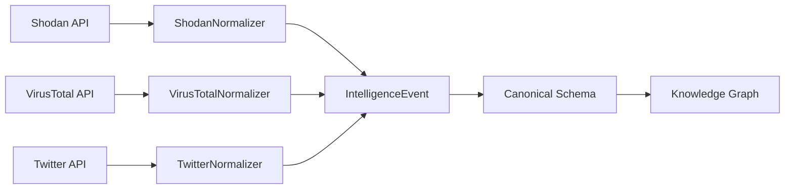

## What is Normalization?

OSINT tools return data in wildly different formats - Shodan uses JSON with port arrays, VirusTotal uses nested threat reports, Twitter uses social graph structures. **Normalization** is the process of transforming these diverse formats into a single canonical schema (IntelligenceEvent) that enables unified analysis, cross-tool correlation, and knowledge graph construction.

**Without normalization:**
```json
// Shodan format
{ "ip_str": "1.2.3.4", "ports": [80, 443], "org": "Example Inc" }

// VirusTotal format
{ "data": { "attributes": { "last_analysis_stats": { "malicious": 2 } } } }

// Twitter format
{ "data": { "username": "user", "public_metrics": { "followers_count": 1000 } } }
```

**After normalization:**
```json
{
  "id": "evt-001",
  "tool": "shodan",
  "entities": [{ "id": "ent-001", "type": "infrastructure", "name": "1.2.3.4" }],
  "observations": [{ "property": "open_port", "value": { "port": 443 } }],
  "relationships": []
}
```

## Why Normalization Matters

<AccordionGroup>
  <Accordion title="Unified Analysis" icon="chart-line">
    Query all intelligence data using a single interface:
    ```typescript
    // Find all entities with threat observations
    const threats = events
      .flatMap(e => e.observations)
      .filter(obs => obs.property === 'threat_detected');
    ```
    Without normalization, you'd need 20+ tool-specific parsers.
  </Accordion>

  <Accordion title="Cross-Tool Correlation" icon="link">
    Identify the same entity across multiple sources:
    ```typescript
    // Merge observations from Shodan + VirusTotal for same IP
    const ip = '1.2.3.4';
    const shodanObs = shodanEvent.observations.filter(o => o.entityId === ip);
    const vtObs = vtEvent.observations.filter(o => o.entityId === ip);
    const merged = [...shodanObs, ...vtObs]; // Unified view
    ```
  </Accordion>

  <Accordion title="Knowledge Graph Construction" icon="project-diagram">
    Build a graph where nodes are entities and edges are relationships:
    ```typescript
    // All events share the same schema
    const nodes = events.flatMap(e => e.entities);
    const edges = events.flatMap(e => e.relationships);
    const graph = { nodes, edges }; // Ready for Neo4j/visualization
    ```
  </Accordion>

  <Accordion title="Confidence Scoring" icon="percent">
    Compare confidence across tools:
    ```typescript
    // Which tool is most confident about this threat?
    const threatConfidence = events
      .flatMap(e => e.observations)
      .filter(obs => obs.property === 'threat_score')
      .sort((a, b) => b.confidence - a.confidence);
    ```
  </Accordion>
</AccordionGroup>

## Normalization Architecture



### Base Normalizer Interface

All normalizers implement the `BaseNormalizer<TRawOutput>` interface:

```typescript
export interface BaseNormalizer<TRawOutput = any> {
  readonly toolName: string;

  normalize(
    rawOutput: TRawOutput,
    target: string,
    traceId: string,
    investigationId?: string
  ): IntelligenceEvent;
}
```

**Key responsibilities:**
1. **Entity Extraction** - Identify people, organizations, infrastructure
2. **Observation Capture** - Record facts about entities with confidence scores
3. **Relationship Detection** - Map connections between entities
4. **Source Attribution** - Track which tool provided which data
5. **Confidence Calculation** - Assess data quality and reliability

### Normalizer Registry

Central registry manages all normalizers with auto-discovery:

```typescript
import { NormalizerRegistry } from './server/normalizers';

const normalizerRegistry = NormalizerRegistry.getInstance();

// Get normalizer by tool name
const normalizer = normalizerRegistry.get('shodan');
const event = normalizer.normalize(rawData, target, traceId);

// List all registered normalizers
const tools = normalizerRegistry.listTools(); // ['shodan', 'virustotal', ...]
```

## Normalizer Implementations

### Shodan Normalizer

Transforms infrastructure scan results to entities with port observations:

<CodeGroup>

```typescript Input (Shodan API Response)
{
  "matches": [
    {
      "ip_str": "93.184.216.34",
      "port": 443,
      "transport": "tcp",
      "org": "Example Organization",
      "location": {
        "country_name": "United States",
        "city": "Los Angeles"
      },
      "vulns": ["CVE-2021-44228"]
    }
  ]
}
```

```typescript Output (IntelligenceEvent)
{
  "id": "550e8400-e29b-41d4-a716-446655440000",
  "tool": "shodan",
  "target": "93.184.216.34",
  "status": "success",
  "timestamp": "2024-03-05T10:00:00Z",
  "entities": [
    {
      "id": "ent-001",
      "type": "infrastructure",
      "name": "93.184.216.34",
      "confidence": 0.95,
      "attributes": {
        "org": "Example Organization",
        "country": "United States",
        "city": "Los Angeles"
      }
    }
  ],
  "observations": [
    {
      "id": "obs-001",
      "entityId": "ent-001",
      "property": "open_port",
      "value": { "port": 443, "transport": "tcp" },
      "confidence": 0.95,
      "source": {
        "tool": "shodan",
        "traceId": "trace-001",
        "timestamp": "2024-03-05T10:00:00Z"
      }
    },
    {
      "id": "obs-002",
      "entityId": "ent-001",
      "property": "vulnerability",
      "value": { "cve": "CVE-2021-44228", "severity": "critical" },
      "confidence": 0.90,
      "source": { "tool": "shodan", "traceId": "trace-001" }
    }
  ],
  "relationships": []
}
```

</CodeGroup>

**Normalization rules:**
- Each IP match becomes an `infrastructure` entity
- Open ports become `open_port` observations
- Vulnerabilities become `vulnerability` observations with CVE identifiers
- Location data stored in entity attributes
- Confidence: 0.95 (high - direct scanning)

### VirusTotal Normalizer

Transforms threat analysis to infrastructure entities with threat observations:

<CodeGroup>

```typescript Input (VirusTotal API Response)
{
  "data": {
    "id": "example.com",
    "type": "domain",
    "attributes": {
      "last_analysis_stats": {
        "malicious": 2,
        "suspicious": 1,
        "clean": 85,
        "undetected": 2
      },
      "reputation": -5,
      "categories": {
        "Fortinet": "Malware",
        "Sophos": "Phishing"
      }
    }
  }
}
```

```typescript Output (IntelligenceEvent)
{
  "id": "evt-002",
  "tool": "virustotal",
  "entities": [
    {
      "id": "ent-002",
      "type": "infrastructure",
      "name": "example.com",
      "confidence": 0.95,
      "attributes": {
        "reputation": -5,
        "total_vendors": 90
      }
    }
  ],
  "observations": [
    {
      "id": "obs-003",
      "entityId": "ent-002",
      "property": "threat_analysis",
      "value": {
        "malicious": 2,
        "suspicious": 1,
        "clean": 85,
        "threat_level": "low"
      },
      "confidence": 0.90,
      "source": { "tool": "virustotal" }
    },
    {
      "id": "obs-004",
      "entityId": "ent-002",
      "property": "category",
      "value": { "vendor": "Fortinet", "label": "Malware" },
      "confidence": 0.85
    }
  ]
}
```

</CodeGroup>

**Normalization rules:**
- Domain/IP becomes `infrastructure` entity
- Analysis stats become `threat_analysis` observation
- Vendor categories become individual `category` observations
- Threat level calculated from malicious/suspicious ratios
- Confidence: 0.90 (high - multi-vendor consensus)

### Twitter Normalizer

Transforms social media data to person entities with behavioral observations:

<CodeGroup>

```typescript Input (Twitter API Response)
{
  "data": {
    "id": "123456789",
    "username": "johndoe",
    "name": "John Doe",
    "verified": true,
    "public_metrics": {
      "followers_count": 15000,
      "following_count": 500,
      "tweet_count": 2500
    },
    "created_at": "2015-06-01T00:00:00.000Z"
  }
}
```

```typescript Output (IntelligenceEvent)
{
  "id": "evt-003",
  "tool": "twitter",
  "entities": [
    {
      "id": "ent-003",
      "type": "person",
      "name": "John Doe",
      "aliases": ["johndoe", "@johndoe"],
      "confidence": 0.90,
      "attributes": {
        "verified": true,
        "account_age_days": 3200,
        "platform": "twitter"
      }
    }
  ],
  "observations": [
    {
      "id": "obs-005",
      "entityId": "ent-003",
      "property": "social_influence",
      "value": {
        "platform": "twitter",
        "followers": 15000,
        "tier": "micro"
      },
      "confidence": 0.95
    },
    {
      "id": "obs-006",
      "entityId": "ent-003",
      "property": "engagement_pattern",
      "value": {
        "tweets_per_day": 2.4,
        "follower_ratio": 30
      },
      "confidence": 0.85
    }
  ]
}
```

</CodeGroup>

**Normalization rules:**
- User profile becomes `person` entity
- Username and handle become aliases
- Metrics become `social_influence` observation
- Engagement patterns calculated from post frequency
- Verified status boosts confidence (+0.1)
- Confidence: 0.90 (high for verified, 0.75 for unverified)

## Confidence Calculation

Each normalizer calculates confidence scores based on data quality indicators:

<Tabs>
  <Tab title="Infrastructure (Shodan)">
    **Base confidence:** 0.95

    **Adjustments:**
    - Has organization info: +0.02
    - Has geolocation: +0.02
    - Multiple ports discovered: +0.01
    - Recent scan (< 7 days): No change
    - Stale scan (> 30 days): -0.10

    **Formula:**
    ```typescript
    let confidence = 0.95;
    if (hasOrg) confidence += 0.02;
    if (hasLocation) confidence += 0.02;
    if (ports.length > 3) confidence += 0.01;
    if (daysSinceScan > 30) confidence -= 0.10;
    return Math.min(1.0, confidence);
    ```
  </Tab>

  <Tab title="Threat Intelligence (VirusTotal)">
    **Base confidence:** 0.90

    **Adjustments:**
    - High vendor consensus (>80% agree): +0.05
    - Low vendor consensus (<50% agree): -0.15
    - Trusted vendor flagged (Fortinet, Sophos): +0.03
    - Only unknown vendors flagged: -0.10

    **Formula:**
    ```typescript
    const consensus = clean / totalVendors;
    let confidence = 0.90;
    if (consensus > 0.8) confidence += 0.05;
    if (consensus < 0.5) confidence -= 0.15;
    if (trustedVendorFlagged) confidence += 0.03;
    return Math.max(0.5, Math.min(1.0, confidence));
    ```
  </Tab>

  <Tab title="Social Media (Twitter)">
    **Base confidence:** 0.75

    **Adjustments:**
    - Verified account: +0.15
    - High followers (>10K): +0.05
    - Account age >2 years: +0.03
    - Low engagement (bot-like): -0.20
    - Private account: -0.10

    **Formula:**
    ```typescript
    let confidence = 0.75;
    if (verified) confidence += 0.15;
    if (followers > 10000) confidence += 0.05;
    if (accountAgeDays > 730) confidence += 0.03;
    if (isBotLike) confidence -= 0.20;
    if (isPrivate) confidence -= 0.10;
    return Math.max(0.5, Math.min(1.0, confidence));
    ```
  </Tab>
</Tabs>

## Handling Edge Cases

### Missing Data

When required fields are missing, normalizers use fallback strategies:

```typescript
// Example: Twitter user with no metrics
const followers = data.public_metrics?.followers_count ?? 0;
const confidence = followers > 0 ? 0.90 : 0.60; // Lower confidence for incomplete data

const observation = {
  property: 'social_influence',
  value: { followers, tier: this.calculateTier(followers) },
  confidence,
  metadata: { incomplete_data: followers === 0 }
};
```

### API Errors

When tools fail, normalizers return error events:

```typescript
{
  "id": "evt-error-001",
  "tool": "shodan",
  "status": "error",
  "error": {
    "code": "API_RATE_LIMIT",
    "message": "Rate limit exceeded. Retry after 60s."
  },
  "entities": [],
  "observations": []
}
```

### Data Conflicts

When multiple tools report conflicting data:

```typescript
// Shodan says org: "Example Inc"
// VirusTotal says org: "Example Corporation"

// Strategy: Prefer higher-signal source (Shodan Layer 2 > VirusTotal threat intel)
const primaryOrg = shodanEntity.attributes.org; // "Example Inc"
const alternateOrg = vtEntity.attributes.org; // "Example Corporation"

// Store alternate as alias
entity.aliases.push(alternateOrg);
```

## Testing Normalizers

Each normalizer includes comprehensive unit tests:

```typescript
// tests/unit/shodanNormalizer.test.ts
describe('ShodanNormalizer', () => {
  it('should normalize IP scan with ports', () => {
    const rawOutput = {
      matches: [{
        ip_str: '1.2.3.4',
        port: 443,
        transport: 'tcp'
      }]
    };

    const event = normalizer.normalize(rawOutput, '1.2.3.4', 'trace-001');

    expect(event.entities).toHaveLength(1);
    expect(event.entities[0].type).toBe('infrastructure');
    expect(event.observations).toHaveLength(1);
    expect(event.observations[0].property).toBe('open_port');
  });

  it('should handle missing organization gracefully', () => {
    const rawOutput = { matches: [{ ip_str: '1.2.3.4', org: null }] };
    const event = normalizer.normalize(rawOutput, '1.2.3.4', 'trace-001');

    expect(event.entities[0].attributes.org).toBeUndefined();
    expect(event.entities[0].confidence).toBeLessThan(0.95); // Lower confidence
  });
});
```

## Performance Considerations

<AccordionGroup>
  <Accordion title="Batch Normalization">
    Process multiple tool outputs in parallel:
    ```typescript
    const events = await Promise.all(
      results.map(r => {
        const normalizer = registry.get(r.tool);
        return normalizer.normalize(r.data, target, traceId);
      })
    );
    ```
  </Accordion>

  <Accordion title="Lazy Entity Resolution">
    Only deduplicate entities when merging into knowledge graph:
    ```typescript
    // During normalization: Create entities independently
    const event1 = shodan.normalize(...); // Creates entity "1.2.3.4"
    const event2 = vt.normalize(...);     // Creates entity "1.2.3.4" (duplicate)

    // During graph merge: Deduplicate
    const merged = deduplicateEntities([event1, event2]);
    ```
  </Accordion>

  <Accordion title="Streaming Normalization">
    For large datasets, normalize incrementally:
    ```typescript
    for await (const rawOutput of shodanStream) {
      const event = normalizer.normalize(rawOutput, target, traceId);
      await saveToDatabase(event);
    }
    ```
  </Accordion>
</AccordionGroup>

## Adding Custom Normalizers

To add a new OSINT tool:

<Steps>
  <Step title="Create Normalizer Class">
    ```typescript
    // src/server/normalizers/customToolNormalizer.ts
    import { AbstractNormalizer } from './base';

    export class CustomToolNormalizer extends AbstractNormalizer<CustomToolResponse> {
      readonly toolName = 'customtool';

      normalize(rawOutput: CustomToolResponse, target: string, traceId: string): IntelligenceEvent {
        const event = this.createBaseEvent(target, traceId);

        // Extract entities
        const entity = this.createEntity(rawOutput);
        event.entities.push(entity);

        // Create observations
        const obs = this.createObservations(rawOutput, entity.id, traceId);
        event.observations.push(...obs);

        return event;
      }
    }
    ```
  </Step>

  <Step title="Register Normalizer">
    ```typescript
    // src/server/normalizers/index.ts
    import { CustomToolNormalizer } from './customToolNormalizer';

    private registerAllNormalizers(): void {
      const normalizers = [
        new ShodanNormalizer(),
        new VirusTotalNormalizer(),
        new CustomToolNormalizer() // ADD HERE
      ];
      normalizers.forEach(n => this.register(n));
    }
    ```
  </Step>

  <Step title="Add Tests">
    ```typescript
    // tests/unit/customToolNormalizer.test.ts
    import { CustomToolNormalizer } from '../src/server/normalizers/customToolNormalizer';

    describe('CustomToolNormalizer', () => {
      it('should normalize custom tool output', () => {
        const normalizer = new CustomToolNormalizer();
        const event = normalizer.normalize(mockData, 'target', 'trace-001');

        expect(event.tool).toBe('customtool');
        expect(event.entities).toHaveLength(1);
      });
    });
    ```
  </Step>
</Steps>

See [Custom Tools Guide](/osint/custom-tools) for complete integration walkthrough.

## Next Steps

<CardGroup cols={2}>
  <Card title="Canonical Schema" icon="database" href="/osint/canonical-schema">
    Deep dive into IntelligenceEvent data model
  </Card>

  <Card title="Tool Selection" icon="filter" href="/osint/tool-selection">
    Learn about intelligent tool selection
  </Card>

  <Card title="Custom Tools" icon="wrench" href="/osint/custom-tools">
    Add your own OSINT tools
  </Card>

  <Card title="API Reference" icon="code" href="/api/normalization">
    Normalization API documentation
  </Card>
</CardGroup>
