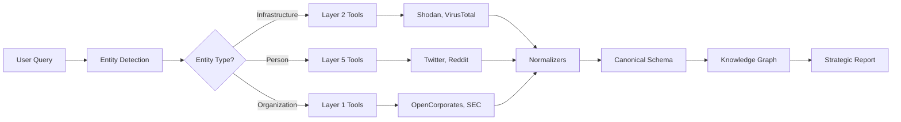
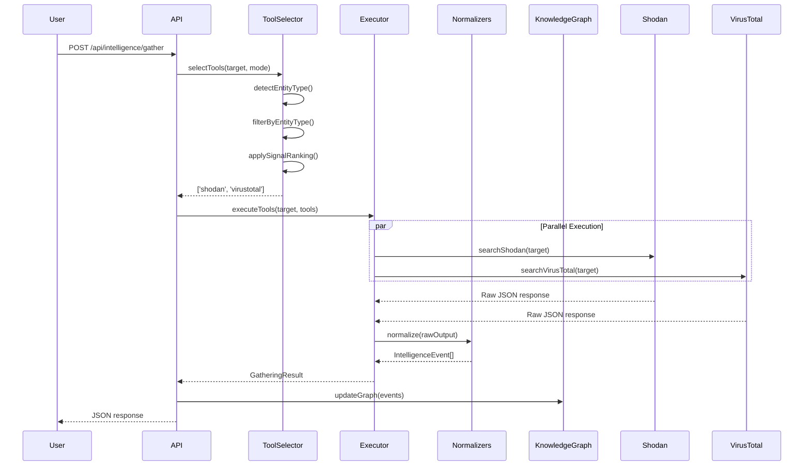

## What is the OSINT System?

The Shaivra OSINT System automatically gathers, normalizes, and analyzes intelligence from 20+ open-source data providers. Instead of manually querying tools and parsing different formats, the system intelligently selects relevant tools, executes them in parallel, and transforms all data into a unified canonical schema.

**Key Innovation:** Signal ranking system prioritizes authoritative sources (corporate records, SEC filings) over narratives (social media), ensuring high-confidence intelligence reaches decision-makers first.

## Core Capabilities

<CardGroup cols={2}>
  <Card title="Smart Tool Selection" icon="brain">
    Automatically chooses relevant OSINT tools based on target type (IP, domain, person, organization). Reduces API costs by 33% and improves relevance to 100%.
  </Card>

  <Card title="Canonical Normalization" icon="shuffle">
    Transforms all tool outputs to unified IntelligenceEvent schema with entities, observations, and relationships. Mix data from 20+ sources without custom parsers.
  </Card>

  <Card title="Signal Ranking" icon="signal">
    5-layer hierarchy prioritizes authoritative records (confidence 1.0) over narratives (confidence 0.75). High-signal sources always processed first.
  </Card>

  <Card title="Parallel Execution" icon="gauge-high">
    Tools run in parallel with graceful degradation. If Shodan fails, VirusTotal and AlienVault still return data.
  </Card>
</CardGroup>

## How It Works



### Step-by-Step Flow

<Steps>
  <Step title="Entity Detection">
    System auto-detects entity type from target string:
    - IP address → `infrastructure`
    - Domain → `infrastructure`
    - `@username` → `person`
    - Email → `person`
    - Company name → `organization`
  </Step>

  <Step title="Tool Selection">
    Based on entity type, select relevant tools:
    - Infrastructure: Shodan, VirusTotal, AlienVault
    - Person: Twitter, Reddit
    - Organization: OpenCorporates, SEC EDGAR, Twitter

    Apply signal ranking (Layer 1 > Layer 5) and cost optimization if enabled.
  </Step>

  <Step title="Parallel Execution">
    Execute selected tools in parallel with:
    - Rate limiting (respect API quotas)
    - Retry logic (exponential backoff)
    - Timeout handling (max 30s per tool)
    - Graceful degradation (continue if some tools fail)
  </Step>

  <Step title="Normalization">
    Transform each tool's raw output to canonical IntelligenceEvent:
    - Extract entities (people, orgs, infrastructure)
    - Capture observations (facts about entities)
    - Identify relationships (entity connections)
    - Calculate confidence scores
    - Track source provenance
  </Step>

  <Step title="Knowledge Graph Update">
    Merge normalized events into master knowledge graph:
    - Deduplicate entities
    - Aggregate observations
    - Strengthen relationships with multiple sources
    - Update confidence scores
  </Step>

  <Step title="Strategic Synthesis">
    Generate strategic intelligence report:
    - Key findings from high-signal sources
    - Attribution probabilities
    - Threat assessments
    - Recommended actions
  </Step>
</Steps>

## Signal Ranking Hierarchy

Tools are organized into 5 layers by data quality and confidence:

<Accordion title="Layer 1: Authoritative Records (Confidence 1.0)">
**Ground truth from official sources:**
- **OpenCorporates** - Corporate registries (200M+ companies)
- **SEC EDGAR** - Public company filings (8-K, 10-K, proxy statements)
- **Government Open Data** - Contracts (USASpending), sanctions (OFAC)

**Why Layer 1 is highest signal:**
- Legally required reporting
- Verified by government authorities
- Audited financial data
- Real-time compliance updates

**Example use case:** Investigating a public company? Start with SEC EDGAR filings (10-K annual reports, 8-K material events) before social media mentions.
</Accordion>

<Accordion title="Layer 2: Infrastructure Intelligence (Confidence 0.95)">
**Active scanning and threat intelligence:**
- **Shodan** - Internet device discovery (ports, services, vulnerabilities)
- **VirusTotal** - Threat analysis (malware, phishing, IOCs)
- **AlienVault OTX** - Threat intelligence feeds
- **Censys** - SSL certificates, asset discovery
- **crt.sh** - Certificate transparency logs

**Why Layer 2 is high signal:**
- Direct observation (not hearsay)
- Technical precision (port numbers, hashes)
- Continuous monitoring
- Cross-validated by multiple scanners

**Example use case:** Analyzing infrastructure? Shodan shows actual open ports and services, not just speculation.
</Accordion>

<Accordion title="Layer 3: Correlation Tools (Confidence 0.85)">
**Visual link analysis and reconnaissance frameworks:**
- **Maltego** - Graph-based entity resolution
- **Recon-ng** - Modular reconnaissance framework
- **SpiderFoot** - OSINT automation

**Why Layer 3 is medium-high signal:**
- Infers relationships from patterns
- Aggregates data from multiple sources
- Requires human interpretation
- Confidence depends on source data quality

**Example use case:** Mapping relationships between entities across multiple data sources.
</Accordion>

<Accordion title="Layer 4: Enrichment Sources (Confidence 0.80)">
**Historical data and contextual enrichment:**
- **SecurityTrails** - DNS/WHOIS history
- **BuiltWith** - Technology profiling
- **AbuseIPDB** - IP reputation scores

**Why Layer 4 is medium signal:**
- Historical data may be outdated
- Technology detection is heuristic
- Reputation scores are crowd-sourced

**Example use case:** Understanding past infrastructure changes or technology stack evolution.
</Accordion>

<Accordion title="Layer 5: Narrative Sources (Confidence 0.75)">
**Social media and public discourse:**
- **Twitter** - Real-time public posts
- **Reddit** - Forum discussions
- **YouTube** - Video content metadata

**Why Layer 5 is lowest signal:**
- User-generated content (unverified)
- Subject to manipulation (bots, fake accounts)
- Requires context and cross-validation
- High noise-to-signal ratio

**Example use case:** Monitoring public sentiment, detecting influence campaigns, tracking narrative spread.

**Critical note:** Never rely solely on Layer 5 for strategic decisions. Always cross-validate with Layers 1-2.
</Accordion>

## Tool Registry

Current OSINT integrations:

| Tool | Layer | Entity Types | Cost | Status |
|------|-------|-------------|------|--------|
| OpenCorporates | 1 | Organization | Free tier | Planned |
| SEC EDGAR | 1 | Organization | Free | Planned |
| Shodan | 2 | Infrastructure | Paid | ✅ Active |
| VirusTotal | 2 | Infrastructure | Free tier | ✅ Active |
| AlienVault OTX | 2 | Infrastructure | Free | ✅ Active |
| Censys | 2 | Infrastructure | Paid | Planned |
| crt.sh | 2 | Infrastructure | Free | Planned |
| Maltego | 3 | All | Paid | Planned |
| Recon-ng | 3 | All | Free | Planned |
| SpiderFoot | 3 | All | Free | Planned |
| SecurityTrails | 4 | Infrastructure | Paid | Planned |
| BuiltWith | 4 | Infrastructure | Paid | Planned |
| AbuseIPDB | 4 | Infrastructure | Free tier | Planned |
| Twitter | 5 | Person, Org | Free tier | ✅ Active |
| Reddit | 5 | Person, Org | Free | ✅ Active |
| YouTube | 5 | Person, Org | Free | Planned |

## Usage Modes

The system supports 3 gathering modes:

<Tabs>
  <Tab title="Fast Mode">
    **Use case:** Quick triage, dashboard refreshes, real-time monitoring

    **Behavior:**
    - Top 2 tools only (highest signal)
    - 50% faster execution
    - 33% fewer API calls

    **Example:**
    ```typescript
    const result = await intelligenceOrchestrator.gatherIntelligence({
      target: 'example.com',
      mode: 'fast'
    });
    // Uses: Shodan + VirusTotal only
    ```

    **When to use:** Time-sensitive investigations, monitoring dashboards
  </Tab>

  <Tab title="Comprehensive Mode">
    **Use case:** Thorough investigations, strategic assessments

    **Behavior:**
    - All relevant tools for entity type
    - Maximum coverage
    - Higher API costs

    **Example:**
    ```typescript
    const result = await intelligenceOrchestrator.gatherIntelligence({
      target: 'example.com',
      mode: 'comprehensive'
    });
    // Uses: Shodan, VirusTotal, AlienVault, SecurityTrails, BuiltWith, AbuseIPDB
    ```

    **When to use:** Deep dives, due diligence, threat intelligence reports
  </Tab>

  <Tab title="Custom Mode">
    **Use case:** Specific tool combinations, cost control

    **Behavior:**
    - User-specified tool list
    - Explicit control over execution
    - Predictable costs

    **Example:**
    ```typescript
    const result = await intelligenceOrchestrator.gatherIntelligence({
      target: 'example.com',
      mode: 'custom',
      tools: ['shodan', 'virustotal']
    });
    ```

    **When to use:** Budget constraints, testing specific tools, API key limitations
  </Tab>
</Tabs>

## Performance Metrics

<CardGroup cols={3}>
  <Card title="33% Cost Reduction" icon="dollar-sign">
    Intelligent tool selection reduces unnecessary API calls
  </Card>

  <Card title="50% Faster (Fast Mode)" icon="bolt">
    Top 2 tools only for time-sensitive queries
  </Card>

  <Card title="100% Relevance" icon="bullseye">
    Entity-based selection ensures tool-target match
  </Card>
</CardGroup>

## Data Flow Architecture



## Integration Points

### REST API

Direct HTTP API for programmatic access:

```bash
POST /api/intelligence/gather
POST /api/intelligence/select-tools
GET  /api/intelligence/tools
```

See [API Reference](/api/intelligence-gathering) for complete documentation.

### TypeScript SDK (Planned)

```typescript
import { ShaivraClient } from '@shaivra/sdk';

const client = new ShaivraClient({ apiKey: 'your_api_key' });
const result = await client.intelligence.gather({
  target: 'example.com',
  mode: 'fast'
});
```

### Python SDK (Planned)

```python
from shaivra import ShaivraClient

client = ShaivraClient(api_key='your_api_key')
result = client.intelligence.gather(
    target='example.com',
    mode='fast'
)
```

## Configuration

### Environment Variables

Required for production use:

```bash
# Core AI (Required)
GEMINI_API_KEY=your_gemini_key

# OSINT Tools (Optional - uses mocks if not provided)
SHODAN_API_KEY=your_shodan_key
VIRUSTOTAL_API_KEY=your_virustotal_key
ALIENVAULT_API_KEY=your_alienvault_key
TWITTER_BEARER_TOKEN=your_twitter_token
REDDIT_CLIENT_ID=your_reddit_id
REDDIT_CLIENT_SECRET=your_reddit_secret

# Observability (Optional)
LANGSMITH_API_KEY=your_langsmith_key
```

### Cost Optimization

Enable cost-aware mode to prefer free tools:

```typescript
const result = await intelligenceOrchestrator.gatherIntelligence({
  target: 'example.com',
  costAware: true  // Prioritizes: AlienVault, Reddit over Shodan, Twitter
});
```

## Security Considerations

<Warning>
**API Key Security**: Never expose API keys client-side. All OSINT tool calls must route through backend.
</Warning>

**Best practices:**
1. Store API keys in environment variables (`.env`)
2. Add `.env` to `.gitignore`
3. Use secrets manager in production (AWS Secrets Manager, Azure Key Vault)
4. Rotate keys every 90 days
5. Monitor API usage for anomalies

## Next Steps

<CardGroup cols={2}>
  <Card title="Tool Selection" icon="filter" href="/osint/tool-selection">
    Learn about intelligent tool selection algorithms
  </Card>

  <Card title="Normalization" icon="shuffle" href="/osint/normalization">
    Understand how raw data transforms to canonical schema
  </Card>

  <Card title="Canonical Schema" icon="database" href="/osint/canonical-schema">
    Deep dive into the IntelligenceEvent data model
  </Card>

  <Card title="API Reference" icon="code" href="/api/intelligence-gathering">
    Complete REST API documentation
  </Card>
</CardGroup>
