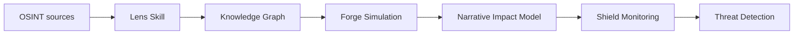

# Intelligence Pipeline DAG

## Flow

## Stages

1. **OSINT sources** — Public web, X, Reddit, LinkedIn, GitHub, news (see lens-intelligence/references/ingestion_sources.md).
2. **Lens** — Ingest → normalize → extract entities → resolve identities → build graph.
3. **Knowledge Graph** — Entity and relationship data; compatible with Neo4j/GraphDB and canonical schema in `src/types/intelligence.ts`.
4. **Forge** — Load graph, identify narrative nodes, model audience segments, simulate propagation, evaluate influence impact.
5. **Narrative Impact Model** — Metrics: reach probability, echo chamber amplification, narrative mutation, resistance threshold.
6. **Shield** — Credential leak check, domain watch, honeypot deployment (stubs or live per env).
7. **Threat Detection** — Alerts and threat_surface.json.

## Schema alignment

- **Skill-layer** objects (Intelligence Object, Relationship Object, Narrative Object) are documented in `skills/lens-intelligence/references/schemas.md`.
- **Canonical** types: `EntityReference`, `Observation`, `Relationship`, `IntelligenceEvent` in `src/types/intelligence.ts`. All pipeline outputs that feed the app must map to these types.
