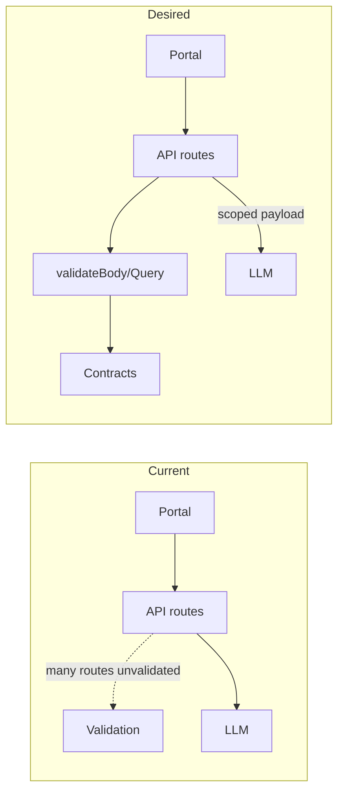

# Full-Stack Audit: Frontend, Backend, Schemas, and Tool Data

**Date:** 2026-03-05  
**Scope:** server.ts, src/contracts/, src/server/validation/schemas.ts, src/server/middleware/validate.ts, normalizers, osintAggregator, portalApi.ts, Lens/PipelineMonitor, docs/ingestion-and-concerns.md.  
**Out of scope:** global-graph subfolder; skills/langgraph script internals (only their I/O contracts when invoked from server).

---

## 1. API Route Catalog

For each `/api/` route: route, middleware (auth, validateBody/validateQuery), request body/query usage, response shape (from code inspection).

| Method | Route | Middleware | Body/Query | Response shape |
|--------|--------|------------|------------|----------------|
| POST | /api/search | authenticate, anyAuthenticated, searchLimiter, aiLimiter, **validateBody(searchSchema)** | body: query, traceId | { text, sources?, groundingMetadata? } |
| GET | /api/osint/shodan | authenticate, searchLimiter, **validateQuery(osintQuerySchema)** | query: query, type? | raw tool data (JSON) |
| GET | /api/osint/alienvault | authenticate, searchLimiter, **validateQuery(osintQuerySchema)** | query: query, type? | raw tool data |
| GET | /api/osint/virustotal | authenticate, searchLimiter, **validateQuery(osintQuerySchema)** | query: query, type? | raw tool data |
| GET | /api/osint/aggregate | authenticate, searchLimiter, **validateQuery(osintQuerySchema)** | query: query, type? | OSINTResult (report) |
| GET | /api/social/twitter/search | authenticate, searchLimiter, **validateQuery(osintQuerySchema)** | query: query, type? | data |
| GET | /api/social/reddit/search | authenticate, searchLimiter, **validateQuery(osintQuerySchema)** | query: query, type? | data |
| GET | /api/social/aggregate | authenticate, searchLimiter, **validateQuery(osintQuerySchema)** | query: query, type? | data |
| GET | /api/social/monitor/:username | authenticate, searchLimiter | query: platforms? | data |
| POST | /api/cli/sherlock | authenticate, searchLimiter | body (unvalidated) | { data, jobId? } |
| POST | /api/cli/theharvester | authenticate, searchLimiter | body (unvalidated) | { data, jobId? } |
| GET | /api/cli/job/:jobId | authenticate | params: jobId, query: queue? | status |
| GET | /api/cli/stats | authenticate | — | { pending, completed, ... } |
| POST | /api/documents/upload | authenticate, upload.single('file') | file (multipart) | { fileId, ... } |
| POST | /api/summarize | — | body: **data, target** | { summary } |
| POST | /api/report | — | body: **pipelineData, target** | report JSON + agent_certainty, agent_logs, citations |
| GET | /api/osint/fingerprint | — | **query: url** | JSON.parse(response.text) |
| POST | /api/analytics/summary | — | body: **target, sector** | JSON (intelligence summary) |
| POST | /api/search/filtered | — | body: **organization, targets, query** | { results, certainty, agent_logs, citations } |
| POST | /api/bot/start | — | body: **sector, focus** | JSON (state object) |
| GET | /api/admin/reports/daily | — | — | report (JSON) |
| GET | /api/admin/reports/weekly | — | — | report (JSON) |
| GET | /api/trends | — | — | trends (array) |
| GET | /api/graph/master | — | — | masterGraph (may be undefined if initphase) |
| GET | /api/graph/global-search | — | query: q | results |
| POST | /api/forge/analyze | — | body: **target, scenario, lensData, globalGraphData** | JSON (consensus_summary, etc.) |
| POST | /api/analysis/combinatorial | — | body: **target, entities** | result (novel_links, decision_tree, etc.) |
| GET | /api/stats | — | — | { total_entities, ... } |
| POST | /api/clips | authenticate, **validateBody(clipSchema)** | body: title, content, source?, tags? | clip |
| GET | /api/clips | authenticate | — | clips array |
| POST | /api/org/profile | — | body: **orgName, objective** | { jobId } |
| GET | /api/org/profile/:jobId | — | params: jobId | job object |
| POST | /api/org/profile/update | — | body: profile | updated profile |
| GET | /api/projects | authenticate | — | projects array |
| POST | /api/projects | authenticate, **validateBody(projectSchema)** | body: name, description?, settings? | project |
| GET | /api/history | — | — | searchHistory |
| POST | /api/ingestion/advanced | — | body: **query, projectId, sources, filters** | { job_ids, status, data } |
| POST | /api/osint/maltego | — | body: **target, transform** | { status, results } |
| GET | /api/analytics/links | — | query: projectId | links array |
| POST | /api/jobs/correlate | — | body: **jobIds** | { nodes, links } |
| GET | /api/rss | — | — | feeds array |
| POST | /api/agent/investigate | — | body: **target, sector, focus** (FE also sends entityTypes) | { runId } |
| GET | /api/agent/investigate/:runId | — | params: runId | investigation object |
| PATCH | /api/projects/:projectId/settings | authenticate | body: **settings** | updated project |
| GET | /api/csrf-token | csrfProtection | — | { csrfToken } |
| POST | /api/auth/login | authLimiter, **validateBody(loginSchema)** | body: email, password, turnstileToken? | { user, token, ... } |
| POST | /api/auth/register | authLimiter, **validateBody(registerSchema)** | body: email, password, role? | { user, token, ... } |
| POST | /api/auth/logout | authenticate | — | { message } |

---

## 2. Frontend Call Catalog

From portalApi and direct `fetch('/api/...')`: endpoint and expected request/response shape.

| Frontend method / usage | Endpoint | Request sent | Expected response |
|-------------------------|----------|--------------|-------------------|
| portalApi.login | POST /api/auth/login | { email, password, turnstileToken? } | { user, token } or error |
| portalApi.register | POST /api/auth/register | { email, password, role? } | { user, token } or error |
| portalApi.realSearch | POST /api/search | { query, traceId? } | { text, sources? } |
| Shodan/AlienVault/VirusTotal | GET /api/osint/shodan etc. | query, type | tool JSON |
| portalApi.summarizeIntelligence | POST /api/summarize | **{ data, target }** | { summary } |
| portalApi.fingerprintWebsite | GET /api/osint/fingerprint | url (query) | fingerprint JSON |
| portalApi.generateStrategicReport | POST /api/report | **{ pipelineData, target }** | report + agent_* |
| portalApi.getIntelligenceSummary | POST /api/analytics/summary | { target, sector } | summary JSON |
| portalApi.startAutonomousBot | POST /api/bot/start | { sector, focus } | state JSON |
| portalApi.getDailyIntelligence | GET /api/admin/reports/daily | — | report |
| portalApi.getWeeklyIntelligence | (mock only) | — | report shape |
| portalApi.getMasterGraph | GET /api/graph/master | — | graph (nodes, links, metadata) |
| portalApi.searchGlobalGraph | GET /api/graph/global-search | q | results |
| portalApi.runFilteredSearch | POST /api/search/filtered | **{ organization, targets }** (no query) | { results, certainty, ... } |
| portalApi.analyzeForgeScenario | POST /api/forge/analyze | { target, scenario, lensData, globalGraphData } | forge JSON |
| portalApi.getProjects | GET /api/projects | — | projects |
| portalApi.createProject | POST /api/projects | { name, description } | project |
| portalApi.updateProjectSettings | PATCH /api/projects/:id/settings | { settings } | updated project |
| portalApi.getSearchHistory | GET /api/history | — | array |
| portalApi.runAdvancedIngestion | POST /api/ingestion/advanced | { projectId, query, sources, filters? } | { job_ids, status, data } |
| portalApi.correlateJobs | POST /api/jobs/correlate | { jobIds } | { nodes, links } |
| portalApi.runMaltegoTransform | POST /api/osint/maltego | { target, transform } | { status, results } |
| portalApi.getAnalyticsLinks | GET /api/analytics/links | projectId | links |
| portalApi.getKnowledgeBaseStats | GET /api/stats | — | stats |
| portalApi.runCombinatorialAnalysis | POST /api/analysis/combinatorial | { target, entities } | result |
| portalApi.saveClip | POST /api/clips | { title, content, source } | clip |
| portalApi.getClips | GET /api/clips | — | clips |
| portalApi.profileOrganisation | POST /api/org/profile | { orgName, objective } | { jobId } |
| portalApi.pollOrgProfiling | GET /api/org/profile/:jobId | — | job |
| portalApi.updateOrgProfile | POST /api/org/profile/update | profile | profile |
| portalApi.startAgentInvestigation | POST /api/agent/investigate | **{ target, sector, focus, entityTypes? }** | { runId } |
| portalApi.pollAgentInvestigation | GET /api/agent/investigate/:runId | — | investigation |
| DailyReports.tsx | fetch('/api/rss') | — | feeds |
| PipelineMonitor (simulate*) | portalApi.ingestEvent, normalizeEvent, enrichEvent, etc. | various | **Expect meta.trace_id** in nested data (ingested → normalized → enriched → extracted) |
| Lens.tsx | normalization?.meta.trace_id, enrichment?.meta.trace_id, etc. | — | **Expect meta.trace_id** on pipeline step results |
| AdvancedRecon.tsx | ingRes.data.meta.trace_id | — | **Expect data.meta.trace_id** on ingestion response |

---

## 3. Validation Gaps (Request)

**Schema exists but not applied on route:** reportSchema, summarizeSchema, investigationSchema, forgeAnalysisSchema, ingestionSchema (validation/schemas.ts). server.ts imports reportSchema, investigationSchema, forgeAnalysisSchema but does not use them on the corresponding routes.

| Route | Schema in code | Applied? | Body field alignment |
|-------|----------------|----------|----------------------|
| POST /api/summarize | summarizeSchema | No | **Mismatch:** handler uses `data`, `target`; schema has `data`, `domain` (optional). target vs domain. |
| POST /api/report | reportSchema | No | reportSchema matches (pipelineData, target); not applied. |
| POST /api/ingestion/advanced | (ingestionSchema exists, different shape) | No | Handler: query, projectId, sources, filters. ingestionSchema: sources[], filters; no query/projectId. **query.split(',')** throws if query missing. |
| POST /api/agent/investigate | investigationSchema | No | **Mismatch:** handler uses target, sector, focus; schema has target, goal. Frontend sends entityTypes (unused by handler). |
| POST /api/forge/analyze | forgeAnalysisSchema | No | **Mismatch:** handler uses target, scenario, lensData, globalGraphData; schema has scenario, constraints, traceId only. |
| POST /api/search/filtered | filteredSearchSchema | No | Handler: organization, targets, query. filteredSearchSchema: query, filters?, traceId?. Different. |
| POST /api/bot/start | botStartSchema | No | Handler: sector, focus. botStartSchema: objective, target, mode?. Different. |
| POST /api/analytics/summary | (analyticsQuerySchema exists for domain/timeRange) | No | Handler: target, sector. analyticsQuerySchema: domain, timeRange. Different. |
| POST /api/org/profile | orgProfileSchema | No | Matches (orgName, objective). Not applied. |
| POST /api/documents/upload | — | No | file only; no body schema. |
| POST /api/cli/sherlock, /api/cli/theharvester | — | No | Body unvalidated. |
| POST /api/org/profile/update | — | No | body: profile (full object). |
| POST /api/jobs/correlate | — | No | body: jobIds. |
| POST /api/analysis/combinatorial | — | No | body: target, entities. |
| GET /api/osint/fingerprint | fingerprintSchema (query) | No | Uses req.query.url; no validateQuery. |
| PATCH /api/projects/:projectId/settings | — | No | body: settings (no projectUpdateSchema). |

**Deliverable summary:** Routes that must get validateBody or validateQuery: summarize, report, ingestion/advanced, agent/investigate, forge/analyze, search/filtered, bot/start, analytics/summary, org/profile, org/profile/update, jobs/correlate, analysis/combinatorial, osint/fingerprint (validateQuery), projects/:id/settings (body). Align summarize (target vs domain), investigation (goal vs sector/focus), forge (add target, lensData, globalGraphData to schema or new schema), ingestion (query, projectId, sources, filters), filtered search, bot (sector, focus).

---

## 4. Response Contract Gaps (Backend → Frontend)

- **Portal contract:** portal.ts defines portalMetaSchema, createPortalApiResponseSchema, dashboardDataSchema, ingestionJobSchema, strategicReportSchema, forgeReportSchema, lensIngestionResultSchema, lensNormalizationResultSchema, lensEnrichmentResultSchema, etc. Many endpoints return ad-hoc JSON without a `{ data, meta }` envelope.
- **Frontend expectations:** Lens.tsx uses normalization?.meta.trace_id, enrichment?.meta.trace_id, etc. PipelineMonitor (portalApi) simulate methods return `data.meta.trace_id` and pass it through ingest → normalize → enrich → extract. AdvancedRecon expects ingRes.data.meta.trace_id. So: pipeline step responses and any response that the frontend treats as “portal API” should have a consistent envelope where expected (data + meta with trace_id).

| Endpoint | Current response | Expected (contract or FE) | Gap |
|----------|------------------|---------------------------|-----|
| GET /api/graph/master | masterGraph (raw) | graph shape | masterGraph may be undefined (bridge: initphase); can break FE. |
| GET /api/admin/reports/weekly | report (mock) | — | No persistent storage; ad-hoc shape. |
| POST /api/report | report + agent_* (no envelope) | strategicReportSchema / meta | FE (generateStrategicReport) wraps in data/meta client-side; API does not return meta. |
| POST /api/forge/analyze | raw JSON | forgeReportSchema | No data/meta wrapper. |
| POST /api/ingestion/advanced | { job_ids, status, data } | lensIngestionResult / job_ids | No meta.trace_id; FE may expect trace_id for pipeline chaining. |
| POST /api/summarize | { summary } | — | No meta. |
| POST /api/agent/investigate | { runId } | — | No meta. |
| GET /api/agent/investigate/:runId | investigation object | — | No envelope. |
| POST /api/org/profile | { jobId } | — | No meta. |
| GET /api/org/profile/:jobId | job | — | No envelope. |
| GET /api/trends | trends | — | May be undefined (bridge); document. |

**Deliverable:** Endpoints that should be wrapped or normalized to a contract: report, forge/analyze, ingestion/advanced (add meta with trace_id for pipeline chaining), and any other portal-facing endpoint where the FE expects data/meta. Document impact of masterGraph/searchHistory/trends being undefined (initphase) in bridge.

---

## 5. Pipeline Phase Handoffs (Ingest → Normalize → Enrich)

**Doc:** docs/ingestion-and-concerns.md defines Ingest (IngestionEvent) → Normalize (IntelligenceEvent via normalizers) → Enrich (LensEnrichmentResult, etc.). portal.ts has ingestionEventSchema, normalizedEventSchema, enrichedEventSchema, lensIngestionResultSchema, lensNormalizationResultSchema, lensEnrichmentResultSchema.

**Current data flow (mocks vs real):**

```mermaid
flowchart LR
  subgraph frontend [Frontend]
    Lens[Lens]
    PipelineMon[PipelineMonitor]
  end
  subgraph backend [Backend]
    AdvIngest["POST /api/ingestion/advanced"]
    OSINTAgg["GET /api/osint/aggregate"]
    Norm[Normalizers]
    Report["POST /api/report"]
    Agent["POST /api/agent/investigate"]
  end
  subgraph mocks [Mocks in portalApi]
    ingestEvent[ingestEvent]
    normalizeEvent[normalizeEvent]
    enrichEvent[enrichEvent]
  end
  Lens --> AdvIngest
  Lens --> mocks
  PipelineMon --> mocks
  PipelineMon --> Report
  AdvIngest -->|ad-hoc Gemini schema| job_ids, data
  AdvIngest -.->|does not produce| IntelligenceEvent
  OSINTAgg --> Norm
  Norm --> IntelligenceEvent
  mocks -->|contract: meta.trace_id| Lens
  Agent --> runAgentNetwork
```

**Handoff compliance:**

| Handoff | Contract | Current compliance |
|---------|----------|--------------------|
| Advanced ingestion output → normalizer input | IngestionEvent or normalizer-ready | **Not compliant.** Advanced ingestion uses ad-hoc Gemini schema; does not produce IntelligenceEvent; does not run through normalizers. Doc: “advanced ingestion should either (a) produce output in a form that a normalizer can convert to IntelligenceEvent, or (b) go through a generic ingest step that wraps and then normalizes.” |
| OSINT tool → normalizer | OSINTResult.event = IntelligenceEvent | **Compliant.** Shodan, VirusTotal, AlienVault return OSINTResult with event (IntelligenceEvent) via normalizers. |
| Lens / PipelineMonitor “run” ingest/normalize/enrich | Real endpoints or mocks with contract | **Mocks.** Lens and PipelineMonitor use portalApi simulate methods (ingestEvent, normalizeEvent, enrichEvent, etc.) that return shapes with meta.trace_id. When replaced with real endpoints, responses must satisfy lensIngestionResultSchema, lensNormalizationResultSchema, lensEnrichmentResultSchema (or equivalent) so transition is smooth. |

**Deliverable:** List of handoff points not yet contract-compliant: (1) Advanced ingestion output → normalizer input (no IntelligenceEvent); (2) Real ingest/normalize/enrich HTTP endpoints not yet present (mocks only).

---

## 6. Tool and LLM Payload Scoping

**runAgentNetwork:** Used by report, search/filtered, org/profile, agent/investigate. Internal truncation: `JSON.stringify(currentData).substring(0, 2000)`; coreStrategy truncated to 500 chars. No schema validation on input; payload is whatever the route passes (pipelineData, initialResults, {}).

**generateContent:** Used in summarize, report (after agent), fingerprint, analytics/summary, search/filtered (initial + agent), bot/start, admin/reports/daily, admin/reports/weekly, forge/analyze, analysis/combinatorial, org/profile (extraction + synthesis + agent), ingestion/advanced.

| Endpoint | LLM/tool call | Payload source | Size (current) | Validated/truncated? |
|----------|---------------|----------------|----------------|----------------------|
| POST /api/report | runAgentNetwork then generateContent | pipelineData (full req.body) | 2000 chars (in agent) | reportSchema refines pipelineData &lt; 50KB but **not applied**. Agent truncates to 2000. |
| POST /api/summarize | generateContent | data (req.body) | Unbounded | summarizeSchema refines data &lt; 100KB but **not applied**. |
| POST /api/search/filtered | generateContent then runAgentNetwork | organization, targets, query; then initialResults | initialResults = full LLM JSON | No validation; no truncation on initialResults. |
| POST /api/forge/analyze | generateContent | target, scenario, lensData, globalGraphData (full) | Unbounded | No schema; no truncation. Large lensData/globalGraphData can blow token limit. |
| POST /api/agent/investigate | runAgentNetwork | {} (empty) | 0 | No payload; agent builds from scratch. |
| POST /api/org/profile | generateContent x2 then runAgentNetwork | extracted + synthesized (full) | Unbounded in synthesis; agent truncates to 2000 | No validation. |
| POST /api/ingestion/advanced | generateContent | target, prioritizedSources (from query, sources) | Unbounded | query/sources not validated; query.split(',') can throw. |
| POST /api/analytics/summary | generateContent | target, sector (inline in prompt) | Small | No schema. |
| POST /api/bot/start | generateContent | sector, focus (inline) | Small | No schema. |
| GET /api/admin/reports/daily | generateContent | recentSearches (searchHistory) | Unbounded if history large | No truncation. |
| GET /api/admin/reports/weekly | generateContent | ngoData (mock) | Mock size | — |
| POST /api/analysis/combinatorial | generateContent | target, entities (JSON.stringify) | Unbounded | No schema. |

**Deliverable:** Add validateBody (and apply schema refinements for size) to report, summarize, ingestion/advanced, agent/investigate, forge/analyze. Add explicit truncation or schema max size for: forge (lensData, globalGraphData), search/filtered (initialResults), org/profile (synthesis payload), admin/reports/daily (recentSearches), analysis/combinatorial (entities). Ensure tools receive only needed fields where possible (e.g. report: target + refined agent result, not entire req.body).

---

## 7. Schema Completeness and Reuse

**Defined but unused on routes:** reportSchema, summarizeSchema, investigationSchema, forgeAnalysisSchema, orgProfileSchema (all in validation/schemas.ts). filteredSearchSchema, botStartSchema, analyticsQuerySchema, ingestionSchema (shape differs from advanced ingestion body). fingerprintSchema (could be used as validateQuery for GET /api/osint/fingerprint). projectUpdateSchema (could be used for PATCH project settings).

**Missing or duplicated:**
- **Summarize:** Frontend and handler use `target`; schema has `domain`. Single source of truth: add `target` to summarizeSchema (or alias domain → target) and use on route.
- **Investigation:** Handler and FE use `target`, `sector`, `focus`, `entityTypes`; schema has `target`, `goal`. Align: extend investigationSchema with sector, focus, entityTypes? and use on route; or map sector+focus → goal in adapter.
- **Forge:** Handler uses target, scenario, lensData, globalGraphData; schema has scenario, constraints, traceId. New forgeAnalyzeSchema with target, scenario, lensData (refined max size), globalGraphData (refined max size), traceId? and use on route.
- **Ingestion (advanced):** ingestionSchema in schemas.ts is source-type array; advanced ingestion body is query, projectId, sources, filters. Define advancedIngestionSchema (query, projectId, sources?, filters?) and use on route; keep ingestionSchema for other ingestion endpoints if any.
- **Single source of truth:** Export request/response shapes from src/contracts (portal.ts, intelligence.ts) and reuse in src/server/validation/schemas.ts where possible (e.g. ingestion job, lens results). Validation layer should reference contract types or duplicate only where Zod is required at API boundary.

---

## 8. Prioritized Remediation List

**P0 (critical)**  
- Add validateBody(reportSchema) to POST /api/report.  
- Add validateBody to POST /api/ingestion/advanced (define advancedIngestionSchema: query, projectId, sources?, filters?; prevent query.split on undefined).  
- Add validateBody(investigationSchema) to POST /api/agent/investigate after aligning schema with handler (sector, focus, entityTypes? or map to goal).  

**P1 (high)**  
- Align summarize body with schema: add `target` to summarizeSchema (or use domain as target alias) and add validateBody(summarizeSchema) to POST /api/summarize.  
- Add validateBody to POST /api/forge/analyze: create forgeAnalyzeSchema (target, scenario, lensData, globalGraphData with size limits) and apply.  
- Add validateBody(orgProfileSchema) to POST /api/org/profile.  
- Add validateQuery(fingerprintSchema) for GET /api/osint/fingerprint (url in query).  
- Enforce payload size or truncation for forge (lensData, globalGraphData), runAgentNetwork inputs, and summarize data.  

**P2 (medium)**  
- Response envelope: ensure key portal endpoints (e.g. report, forge/analyze, ingestion/advanced) return or are normalized to { data, meta } where the FE expects meta.trace_id.  
- Document and handle masterGraph/searchHistory/trends undefined (bridge initphase) for GET /api/graph/master, GET /api/history, GET /api/trends.  
- Add validateBody for POST /api/search/filtered, POST /api/bot/start, POST /api/analytics/summary (after schema alignment).  
- Add validateBody for POST /api/jobs/correlate, POST /api/analysis/combinatorial, POST /api/org/profile/update; add body validation for PATCH /api/projects/:projectId/settings (e.g. projectUpdateSchema.settings only).  
- Single source of truth: export shared request/response shapes from contracts and reuse in validation layer where applicable.

---

## 9. Diagram (Current vs Desired)



---

*Audit complete. No code changes applied. Remediation to be split into tasks and executed per initphase after approval.*
